# DOCUMENTACIÓN GRÁFICA DE FLUJOS INTERNOS

**Proyecto:** RIESGO_LAVADO  
**Repositorio:** `jmejia31/RIESGO_LAVADO`  
**Archivo:** `docs/DOCUMENTACION_FLUJOS_INTERNOS_RIESGO_LAVADO.md`  
**Versión:** 1.0  
**Fecha:** 2026-06-29  
**Alcance:** Backend `RL.API` identificado en el repositorio actual.  

---

## 1. Propósito del documento

Este documento describe, de forma técnica, funcional y gráfica, cómo fluye la información dentro del sistema `RIESGO_LAVADO`, desde la acción del usuario hasta el procesamiento interno en API, servicios, repositorios, base de datos Oracle, auditoría y respuesta final.

El objetivo es que este archivo sirva como documentación base para:

- ChatGPT.
- Codex.
- Desarrolladores backend.
- Analistas funcionales.
- Revisores del sistema.
- Continuidad documental del Sistema de Gestión de Riesgos de LA/FT.

---

## 2. Alcance real identificado en el repositorio

En el repositorio actual se identificó una solución de Visual Studio:

```text
RIESGO_LAVADO.sln
└── backend/
    └── RL.API/
        └── RL.API.csproj
```

El proyecto identificado es un backend ASP.NET API con integración a Oracle, JWT, Swagger, BCrypt, Serilog, MailKit y Active Directory.

### 2.1 Elementos confirmados

| Elemento | Estado |
|---|---|
| Solución Visual Studio | Identificada |
| Proyecto backend `RL.API` | Identificado |
| API ASP.NET | Identificada |
| Oracle | Identificado |
| JWT | Identificado |
| Serilog | Identificado |
| Swagger | Identificado |
| Active Directory | Identificado |
| Frontend Angular | No identificado en este repo |
| Módulo de matrices de riesgo | No identificado en archivos revisados |
| Módulo de indicadores de riesgo | No identificado en archivos revisados |
| Módulo de debida diligencia | No identificado en archivos revisados |

---

## 3. Arquitectura general del backend

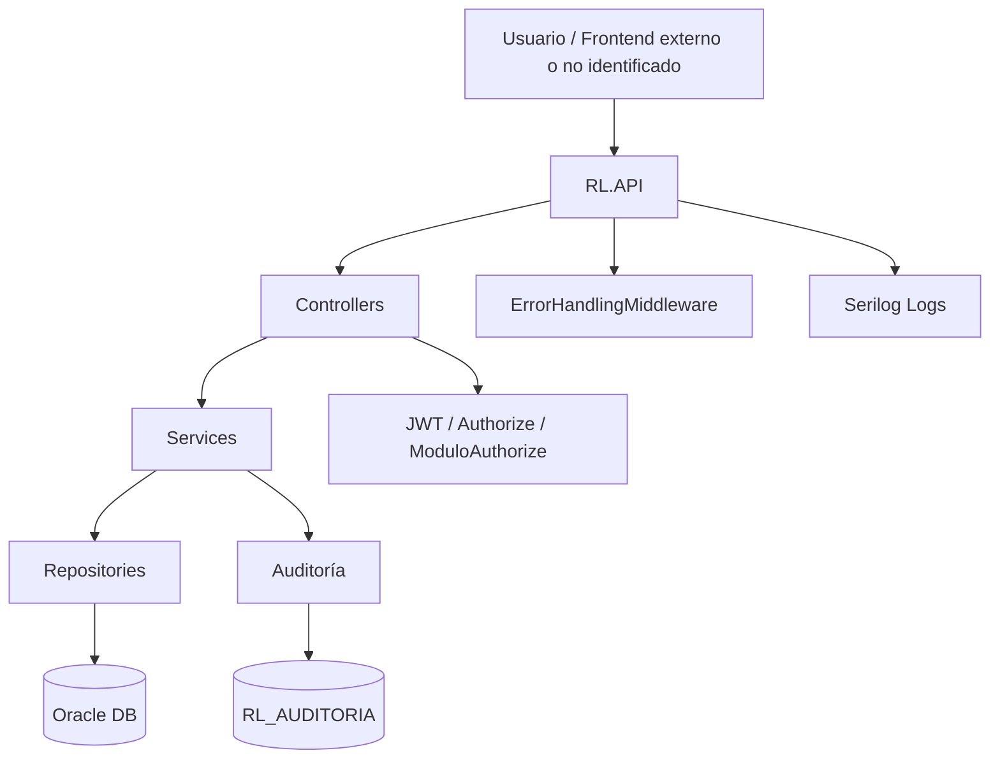

### 3.1 Componentes principales

| Capa | Descripción |
|---|---|
| Controllers | Reciben solicitudes HTTP, validan entrada básica y devuelven respuesta |
| Services | Ejecutan lógica de negocio, autenticación, correo y reglas de seguridad |
| Repositories | Ejecutan consultas y operaciones directas contra Oracle |
| Middleware | Manejo centralizado de errores |
| Auditoría | Registro transversal de acciones relevantes |
| Seguridad | JWT, roles, módulos y autorización |

---

## 4. Módulos identificados

| Módulo | Controlador | Función principal | Estado |
|---|---|---|---|
| Seguridad / Usuarios | `AuthController` | Login, logout, tokens, usuarios, contraseña, perfil | Confirmado |
| Catálogos | `CatalogosController` | Roles, dominios, módulos | Confirmado |
| Configuración | `ConfiguracionController` | Configuración del sistema, slides, imágenes | Confirmado |
| Monitoreo de listas | `ListasController` | Coincidencias, positivos, seguimientos, evidencias, listas cautela | Confirmado |
| Auditoría | `AuditoriaController` | Consulta de bitácora y exportaciones | Confirmado |
| Matrices de riesgo | No identificado | Pendiente de confirmar | Pendiente |
| Indicadores de riesgo | No identificado | Pendiente de confirmar | Pendiente |
| Debida diligencia | No identificado | Pendiente de confirmar | Pendiente |

---

# 5. MÓDULO BASE: SEGURIDAD, AUTENTICACIÓN Y USUARIOS

## 5.1 Objetivo del módulo

Administrar el acceso al sistema mediante credenciales locales o Active Directory, generar tokens JWT, registrar refresh tokens, controlar intentos fallidos, bloquear temporalmente usuarios, gestionar recuperación de contraseña, administración de usuarios, roles y permisos por módulo.

## 5.2 Interfaces o procesos funcionales

| Proceso | Endpoint | Método | Acceso |
|---|---|---:|---|
| Login | `/api/Auth/login` | POST | Público |
| Refresh token | `/api/Auth/refresh` | POST | Público |
| Logout | `/api/Auth/logout` | POST | Autenticado |
| Cambiar contraseña | `/api/Auth/password` | PUT | Autenticado |
| Perfil | `/api/Auth/perfil` | GET | Autenticado |
| Crear usuario | `/api/Auth/usuarios` | POST | Administrador |
| Actualizar usuario | `/api/Auth/usuarios/{uid}` | PUT | Administrador |
| Listar usuarios | `/api/Auth/usuarios` | GET | Administrador |
| Cambiar estado | `/api/Auth/usuarios/{uid}/estado` | PUT | Administrador |
| Validar dominio | `/api/Auth/validar-dominio` | GET | Administrador |
| Recuperar contraseña | `/api/Auth/recuperar-password` | POST | Público |

## 5.3 Flujo general del módulo

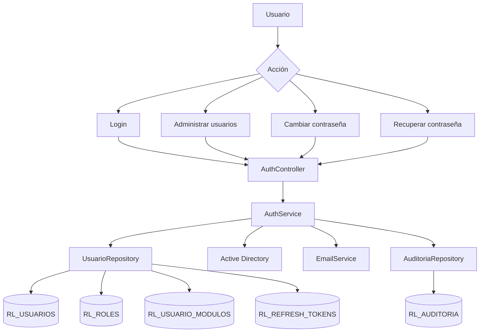

## 5.4 Flujo: iniciar sesión

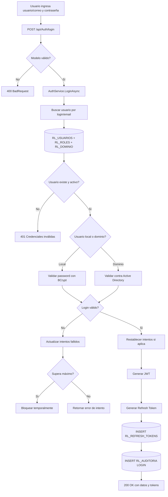

## 5.5 Diagrama de secuencia: login

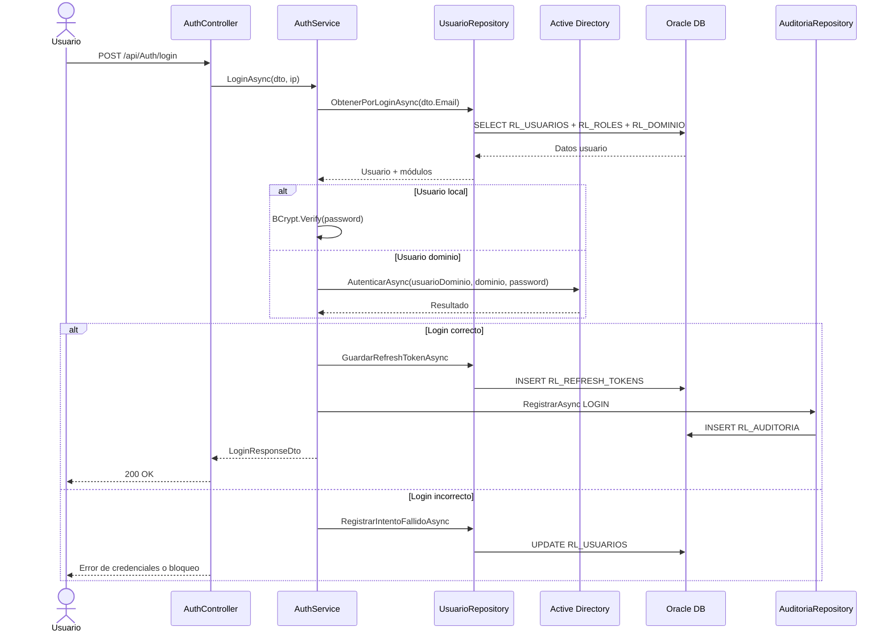

## 5.6 Ciclo de vida del usuario

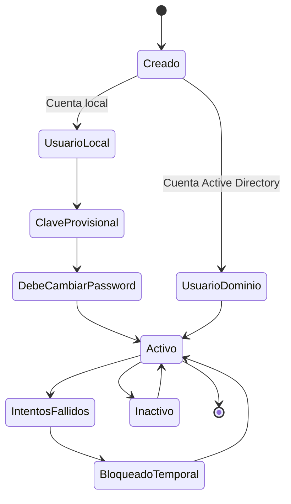

## 5.7 Tablas involucradas

| Tabla | Operación | Uso |
|---|---|---|
| `RL_USUARIOS` | SELECT / INSERT / UPDATE | Datos del usuario, credenciales, estado, bloqueo |
| `RL_ROLES` | SELECT | Rol del usuario |
| `RL_DOMINIO` | SELECT | Dominio institucional |
| `RL_USUARIO_MODULOS` | SELECT / INSERT / DELETE | Permisos por módulo |
| `RL_REFRESH_TOKENS` | SELECT / INSERT / UPDATE | Tokens de sesión |
| `RL_AUDITORIA` | INSERT | Trazabilidad de login/logout/cambios |

---

# 6. MÓDULO CATÁLOGOS

## 6.1 Objetivo del módulo

Proveer datos maestros necesarios para usuarios, permisos y navegación: roles, dominios y módulos.

## 6.2 Procesos identificados

| Proceso | Endpoint | Método |
|---|---|---:|
| Obtener roles | `/api/Catalogos/roles` | GET |
| Obtener dominios | `/api/Catalogos/dominios` | GET |
| Obtener módulos | `/api/Catalogos/modulos` | GET |

## 6.3 Flujo general

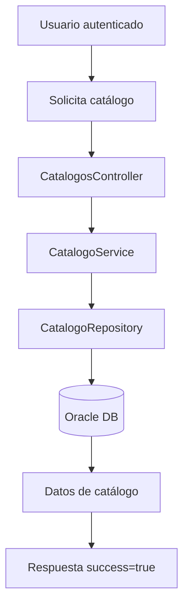

## 6.4 Relación con otros módulos

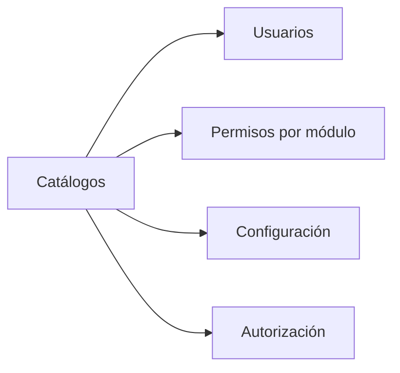

---

# 7. MÓDULO CONFIGURACIÓN DEL SISTEMA

## 7.1 Objetivo del módulo

Administrar parámetros institucionales y visuales del sistema, incluyendo nombre de institución, nombre del sistema, logo, icono, colores, timeout de sesión, acuerdo legal, máximo de intentos, validez de clave temporal, slides de login y carga de imágenes.

## 7.2 Procesos identificados

| Proceso | Endpoint | Método | Acceso |
|---|---|---:|---|
| Obtener configuración pública | `/api/Configuracion/sistema` | GET | Público |
| Actualizar configuración | `/api/Configuracion/sistema` | PUT | Administrador |
| Obtener slides login | `/api/Configuracion/login` | GET | Público |
| Obtener todos los slides | `/api/Configuracion/slides` | GET | Administrador |
| Crear slide | `/api/Configuracion/slides` | POST | Administrador |
| Actualizar slide | `/api/Configuracion/slides/{id}` | PUT | Administrador |
| Eliminar slide | `/api/Configuracion/slides/{id}` | DELETE | Administrador |
| Subir imagen | `/api/Configuracion/slides/upload` | POST | Administrador |

## 7.3 Flujo: actualizar configuración general

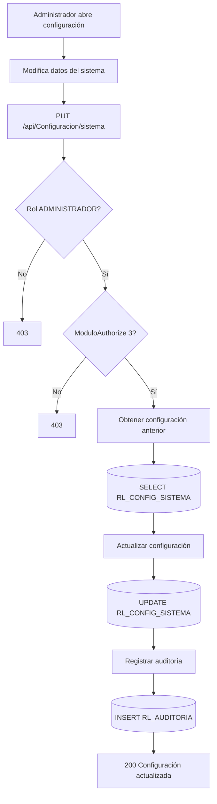

## 7.4 Flujo: subir imagen para slide

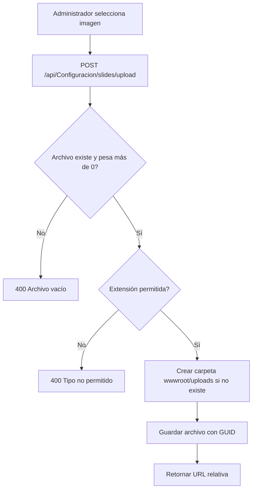

## 7.5 Tablas involucradas

| Tabla | Operación | Uso |
|---|---|---|
| `RL_CONFIG_SISTEMA` | SELECT / UPDATE | Configuración institucional y seguridad general |
| `RL_LOGIN_SLIDES` | SELECT / INSERT / UPDATE / DELETE | Slides del login |
| `RL_AUDITORIA` | INSERT | Trazabilidad de cambios |

---

# 8. MÓDULO MONITOREO DE LISTAS / POSITIVOS

## 8.1 Objetivo del módulo

Gestionar coincidencias y positivos relacionados con listas de cautela, incluyendo personas jurídicas, personas naturales, empleados, patronos, tipos de lista, registro manual de positivos, seguimientos, evidencias, reportes, exportaciones, calificación de coincidencias y carga de archivos.

## 8.2 Procesos identificados

| Proceso | Endpoint | Método |
|---|---|---:|
| Obtener jurídicas | `/api/Listas/juridicas` | GET |
| Obtener naturales | `/api/Listas/naturales` | GET |
| Obtener empleados | `/api/Listas/empleados` | GET |
| Detalle natural | `/api/Listas/naturales/{numeroIdentificacion}/detalle` | GET |
| Detalle empleado | `/api/Listas/empleados/{numeroIdentificacion}/detalle` | GET |
| Tipos documento | `/api/Listas/tipos-documento` | GET |
| Tipos listas cautela | `/api/Listas/tipos-listas-cautela` | GET |
| Resumen listas | `/api/Listas/resumen` | GET |
| Exportar lista | `/api/Listas/{id}/exportar` | GET |
| Crear tipo lista cautela | `/api/Listas/tipos-listas-cautela` | POST |
| Actualizar tipo lista cautela | `/api/Listas/tipos-listas-cautela/{id}` | PUT |
| Eliminar tipo lista cautela | `/api/Listas/tipos-listas-cautela/{id}` | DELETE |
| Registrar positivo | `/api/Listas/positivos` | POST |
| Consultar positivo | `/api/Listas/positivos/{noDocumento}` | GET |
| Consultar seguimientos | `/api/Listas/positivos/{noDocumento}/seguimientos` | GET |
| Registrar seguimiento | `/api/Listas/positivos/{noDocumento}/seguimientos` | POST |
| Descargar evidencia | `/api/Listas/evidencias/{evidenciaId}` | GET |
| Actualizar seguimiento | `/api/Listas/seguimientos/{detalleId}` | PUT |
| Eliminar evidencia | `/api/Listas/evidencias/{evidenciaId}` | DELETE |
| Eliminar seguimiento | `/api/Listas/seguimientos/{detalleId}` | DELETE |
| Registrar reporte impreso | `/api/Listas/positivos/{noDocumento}/reporte-impreso` | POST |
| Resumen coincidencias patrono | `/api/Listas/coincidencias-patrono/resumen` | GET |
| Detalle coincidencias patrono | `/api/Listas/coincidencias-patrono/detalle` | GET |
| Calificar coincidencia patrono | `/api/Listas/coincidencias-patrono/{id}/calificar` | PUT |
| Resumen coincidencias empleado | `/api/Listas/coincidencias-empleado/resumen` | GET |
| Detalle coincidencias empleado | `/api/Listas/coincidencias-empleado/detalle` | GET |
| Calificar coincidencia empleado | `/api/Listas/coincidencias-empleado/{id}/calificar` | PUT |
| Cargar archivo cautela | `/api/Listas/cautela/upload` | POST |

## 8.3 Flujo general del módulo

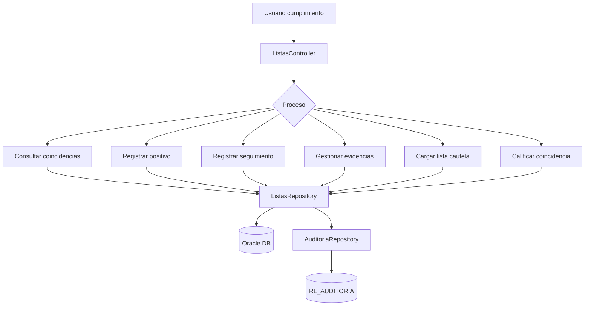

---

## 8.4 Proceso: registrar una persona o entidad como positivo

### 8.4.1 Descripción funcional

Cuando el usuario registra una persona, patrono, empleado o entidad como positivo, el backend valida el modelo recibido, obtiene el usuario autenticado desde el JWT y consulta si ya existe un positivo activo con el mismo número de documento. Si existe, actualiza el registro; si no existe, crea uno nuevo. En ambos casos registra auditoría.

### 8.4.2 Flujo gráfico

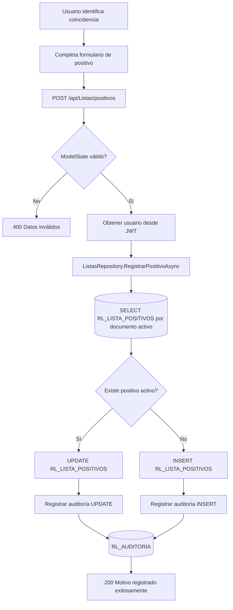

### 8.4.3 Diagrama de secuencia

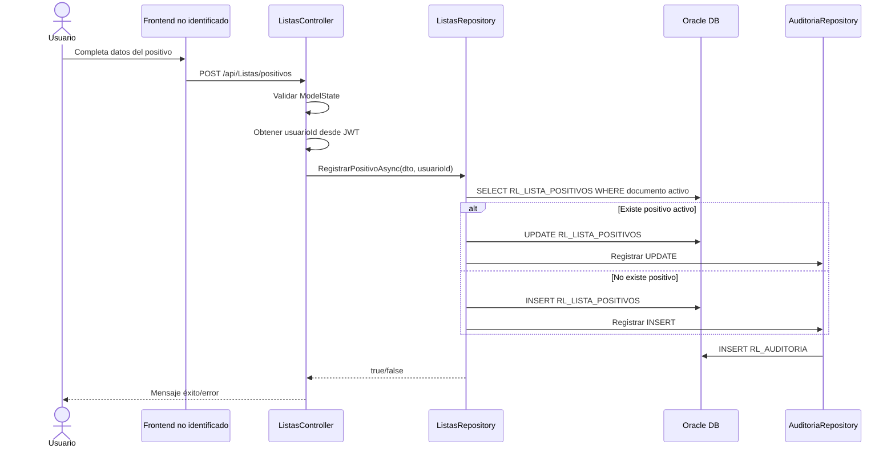

### 8.4.4 Datos procesados

| Dato | Uso |
|---|---|
| TipoDocumentoId | Clasifica documento |
| TipoPositivoId | Clasifica positivo: jurídico, natural, empleado u otro |
| NoDocumento | Identificador principal |
| NombreCompleto | Nombre de persona o entidad |
| MotivoIngreso | Motivo del registro positivo |
| TipoListaCautelaId | Lista asociada, si aplica |
| OrigenRegistro | Origen manual o automático |
| Usuario creador | Tomado desde JWT |

### 8.4.5 Tablas involucradas

| Tabla | Operación | Uso |
|---|---|---|
| `RL_LISTA_POSITIVOS` | SELECT / INSERT / UPDATE | Positivos internos activos |
| `DNP_IHSS.TIPO_LISTAS_CAUTELA` | SELECT / LEFT JOIN | Lista cautela asociada |
| `RL_AUDITORIA` | INSERT | Auditoría de creación o actualización |

---

## 8.5 Proceso: registrar seguimiento con evidencias

### 8.5.1 Descripción funcional

Permite agregar comentario de seguimiento a un positivo activo y adjuntar archivos de evidencia. El comentario es obligatorio. Las evidencias son opcionales, pero si se envían, se validan por nombre, tamaño, extensión y MIME type. Los archivos físicos se guardan en `Uploads/Evidencias` y sus metadatos se registran en base de datos.

### 8.5.2 Flujo gráfico

```mermaid
flowchart TD
    A[Usuario abre expediente positivo] --> B[Escribe comentario de seguimiento]
    B --> C[Adjunta evidencias opcionales]
    C --> D[POST /api/Listas/positivos/{noDocumento}/seguimientos]
    D --> E{Comentario vacío?}
    E -- Sí --> F[400 Comentario obligatorio]
    E -- No --> G[Buscar positivo activo]
    G --> H{Existe positivo?}
    H -- No --> I[404 Positivo no encontrado]
    H -- Sí --> J[Validar archivos]
    J --> K{Archivos válidos?}
    K -- No --> L[400 Error de evidencia]
    K -- Sí --> M[Registrar seguimiento]
    M --> N[(Detalle seguimiento)]
    N --> O[Guardar archivo físico]
    O --> P[Guardar metadata de evidencia]
    P --> Q[200 Seguimiento y evidencia registrados]
```

### 8.5.3 Validaciones de evidencia

| Validación | Regla |
|---|---|
| Nombre | No debe estar vacío |
| Caracteres | No debe contener caracteres inválidos |
| Tamaño | Mayor a 0 y menor o igual al máximo configurado |
| Extensión | PDF, imagen, Word o Excel |
| MIME type | Debe coincidir con el tipo permitido |

### 8.5.4 Ciclo de vida de evidencia

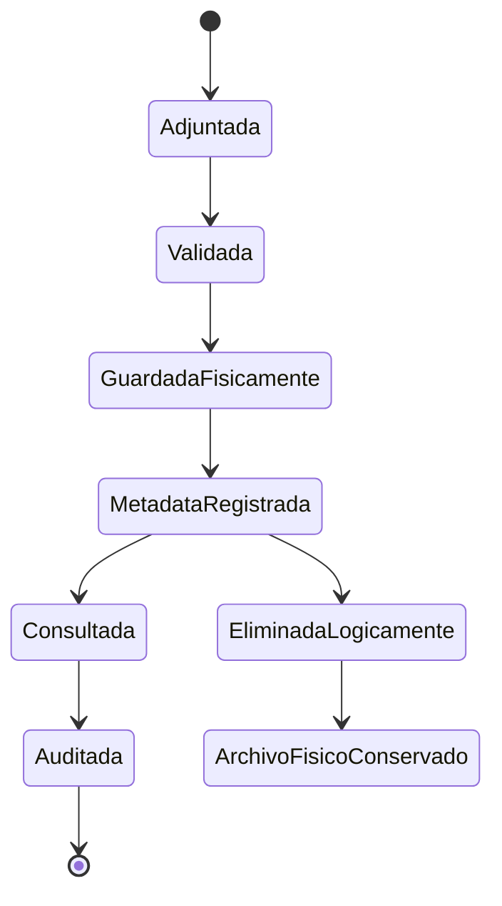

---

## 8.6 Proceso: descargar evidencia

```mermaid
flowchart TD
    A[Usuario solicita evidencia] --> B[GET /api/Listas/evidencias/{evidenciaId}]
    B --> C[Buscar metadatos]
    C --> D{Existe metadata?}
    D -- No --> E[404 Evidencia no encontrada]
    D -- Sí --> F[Construir ruta física]
    F --> G{Archivo físico existe?}
    G -- No --> H[404 Archivo físico no existe]
    G -- Sí --> I[Registrar auditoría de visualización]
    I --> J[Leer archivo]
    J --> K[Retornar archivo]
```

---

## 8.7 Proceso: eliminar evidencia

```mermaid
flowchart TD
    A[Usuario elimina evidencia] --> B[DELETE /api/Listas/evidencias/{evidenciaId}]
    B --> C{Motivo informado?}
    C -- No --> D[400 Motivo obligatorio]
    C -- Sí --> E[Buscar metadata]
    E --> F{Existe evidencia?}
    F -- No --> G[404 No encontrada]
    F -- Sí --> H[Inactivar registro]
    H --> I[Registrar motivo y auditoría]
    I --> J[Conservar archivo físico]
    J --> K[200 Evidencia eliminada]
```

---

## 8.8 Proceso: carga de listas de cautela

### 8.8.1 Descripción funcional

El usuario carga un archivo asociado a un tipo de lista de cautela. El backend valida el archivo y decide el procesador según extensión y descripción de la lista.

### 8.8.2 Flujo gráfico

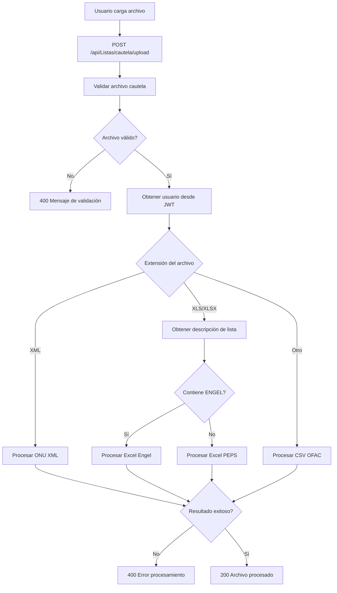

### 8.8.3 Procesadores identificados

| Tipo | Método esperado |
|---|---|
| XML | `ProcesarArchivoXmlOnuAsync` |
| Excel Engel | `ProcesarArchivoExcelEngelAsync` |
| Excel PEPS | `ProcesarArchivoExcelPepsAsync` |
| CSV OFAC | `ProcesarArchivoCsvOfacAsync` |

---

## 8.9 Proceso: calificar coincidencias

```mermaid
flowchart TD
    A[Usuario revisa coincidencia] --> B{Tipo coincidencia}
    B -- Patrono --> C[PUT /api/Listas/coincidencias-patrono/{id}/calificar]
    B -- Empleado --> D[PUT /api/Listas/coincidencias-empleado/{id}/calificar]
    C --> E[Validar cuerpo de solicitud]
    D --> E
    E --> F{Body existe?}
    F -- No --> G[400 Solicitud requerida]
    F -- Sí --> H[Obtener usuarioId desde JWT]
    H --> I[CalificarCoincidenciaAsync]
    I --> J[(Actualizar calificación)]
    J --> K{Registro encontrado?}
    K -- No --> L[404 Registro no encontrado]
    K -- Sí --> M[200 Coincidencia calificada]
```

---

# 9. MÓDULO AUDITORÍA / BITÁCORA

## 9.1 Objetivo del módulo

Registrar y consultar trazabilidad de acciones críticas del sistema: login, logout, creación, actualización, eliminación, visualización, exportación y cambios administrativos.

## 9.2 Procesos identificados

| Proceso | Endpoint | Método |
|---|---|---:|
| Consultar bitácora | `/api/Auditoria` | GET |
| Registrar exportación | `/api/Auditoria/exportacion` | POST |

## 9.3 Flujo: registrar auditoría transversal

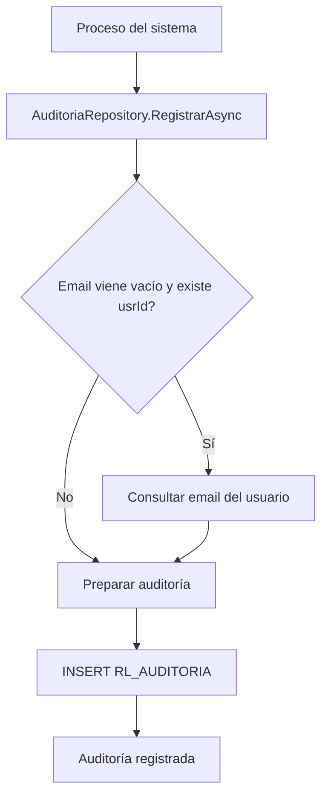

## 9.4 Flujo: consulta de bitácora

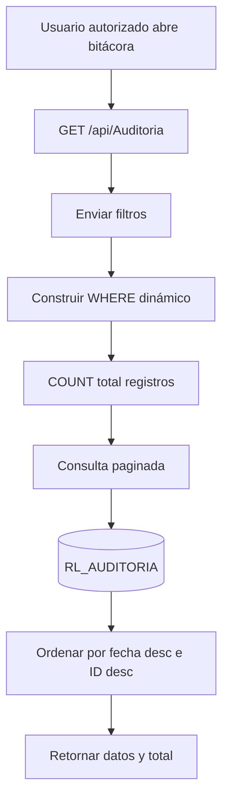

## 9.5 Campos auditados

| Campo | Descripción |
|---|---|
| `AUD_TABLA` | Tabla afectada |
| `AUD_REGISTRO_ID` | Identificador del registro |
| `AUD_ACCION` | Acción ejecutada |
| `AUD_DATOS_ANT` | Datos anteriores |
| `AUD_DATOS_NVO` | Datos nuevos |
| `AUD_USR_ID` | Usuario que ejecuta |
| `AUD_USR_EMAIL` | Email del usuario |
| `AUD_IP` | IP origen |
| `AUD_FECHA` | Fecha de auditoría |
| `AUD_MODULO` | Módulo funcional |

---

# 10. RELACIÓN GENERAL DE DATOS

```mermaid
flowchart LR
    A[Auth / Usuarios] --> B[(RL_USUARIOS)]
    A --> C[(RL_ROLES)]
    A --> D[(RL_DOMINIO)]
    A --> E[(RL_USUARIO_MODULOS)]
    A --> F[(RL_REFRESH_TOKENS)]
    A --> G[(RL_AUDITORIA)]

    H[Configuración] --> I[(RL_CONFIG_SISTEMA)]
    H --> J[(RL_LOGIN_SLIDES)]
    H --> G

    K[Monitoreo Listas] --> L[(RL_LISTA_POSITIVOS)]
    K --> M[(DNP_IHSS.REPORTE_COINCIDENCIAS)]
    K --> N[(DNP_IHSS.TIPO_LISTAS_CAUTELA)]
    K --> O[(Vistas DNP_IHSS)]
    K --> P[(Seguimientos / Evidencias)]
    K --> G

    Q[Auditoría] --> G
    R[Catálogos] --> C
    R --> D
    R --> E
```

---

# 11. CICLO DE VIDA GENERAL DE UN REGISTRO POSITIVO

```mermaid
stateDiagram-v2
    [*] --> Detectado
    Detectado --> Revisado
    Revisado --> RegistradoComoPositivo
    RegistradoComoPositivo --> Actualizado: Si ya existía documento activo
    RegistradoComoPositivo --> ConSeguimiento
    ConSeguimiento --> ConEvidencia
    ConEvidencia --> EvidenciaConsultada
    EvidenciaConsultada --> Auditado
    ConEvidencia --> EvidenciaEliminadaLogicamente
    ConSeguimiento --> SeguimientoEliminadoLogicamente
    RegistradoComoPositivo --> ConsultadoPorModulo
    ConsultadoPorModulo --> Exportado
    Exportado --> Auditado
    Auditado --> [*]
```

---

# 12. MATRIZ DE ARCHIVOS TÉCNICOS CONFIRMADOS

| Archivo | Responsabilidad |
|---|---|
| `backend/RL.API/Program.cs` | Configuración general de API, JWT, CORS, Swagger, DI, middleware |
| `backend/RL.API/RL.API.csproj` | Dependencias y framework del backend |
| `backend/RL.API/Controllers/AuthController.cs` | Endpoints de autenticación y usuarios |
| `backend/RL.API/Controllers/CatalogosController.cs` | Endpoints de catálogos |
| `backend/RL.API/Controllers/ConfiguracionController.cs` | Endpoints de configuración y slides |
| `backend/RL.API/Controllers/ListasController.cs` | Endpoints de monitoreo de listas, positivos, evidencias y coincidencias |
| `backend/RL.API/Controllers/AuditoriaController.cs` | Endpoints de bitácora y auditoría de exportación |
| `backend/RL.API/Services/AuthService.cs` | Lógica de autenticación, tokens, usuarios, contraseña |
| `backend/RL.API/Repositories/UsuarioRepository.cs` | Operaciones Oracle de usuarios, roles, módulos y tokens |
| `backend/RL.API/Repositories/ListasRepository.cs` | Operaciones Oracle de listas, positivos, coincidencias y evidencias |
| `backend/RL.API/Repositories/ConfiguracionRepository.cs` | Operaciones Oracle de configuración y slides |
| `backend/RL.API/Repositories/AuditoriaRepository.cs` | Operaciones Oracle de auditoría |

---

# 13. RIESGOS, VACÍOS Y MEJORAS

## 13.1 Frontend no identificado

No se identificó estructura frontend dentro del repositorio actual. No se confirmó `angular.json`, `package.json`, carpeta `src/app`, servicios Angular ni componentes de interfaz.

**Recomendación:** agregar o enlazar el repositorio frontend, o documentar formalmente su ubicación.

## 13.2 Matrices de riesgo no identificadas

No se confirmó controlador, servicio, repositorio ni tablas específicas para matrices de riesgo en los archivos revisados.

**Recomendación:** crear documentación y/o módulo técnico para matrices antes de iniciar desarrollo, incluyendo scoring, controles, riesgo inherente, residual, ponderaciones y mapa de calor.

## 13.3 Indicadores no identificados

No se confirmó backend específico de indicadores de riesgo.

**Recomendación:** definir controladores, DTOs, repositorios, tablas y endpoints para indicadores/KRI.

## 13.4 Debida diligencia no identificada

No se confirmó backend específico de debida diligencia.

**Recomendación:** definir flujo de registro, actualización, evaluación, documentos soporte, alertas y auditoría.

## 13.5 Auditoría transversal fuerte

Existe un repositorio central de auditoría. Debe mantenerse como regla obligatoria para todos los módulos críticos LA/FT.

**Regla recomendada:** toda operación `INSERT`, `UPDATE`, `DELETE lógico`, `VER`, `EXPORTAR`, `LOGIN`, `LOGOUT` debe generar registro en `RL_AUDITORIA`.

---

# 14. CONCLUSIÓN

El backend actual del sistema `RIESGO_LAVADO` ya posee una base importante para seguridad, configuración, auditoría y monitoreo de listas. El módulo más avanzado funcionalmente es el de monitoreo de listas/positivos, debido a que incluye consultas, registros, seguimientos, evidencias, carga de archivos, exportaciones y calificaciones.

La documentación debe ampliarse cuando se confirme la ubicación del frontend y cuando se agreguen o localicen los módulos de matrices de riesgo, indicadores de riesgo y debida diligencia.

---

# 15. SIGUIENTE PASO RECOMENDADO

Crear documentos complementarios por módulo:

```text
docs/modulos/01_SEGURIDAD_USUARIOS.md
docs/modulos/02_MONITOREO_LISTAS_POSITIVOS.md
docs/modulos/03_CONFIGURACION.md
docs/modulos/04_AUDITORIA.md
docs/modulos/05_MATRICES_RIESGO_PENDIENTE.md
```

Cada documento debe incluir:

- Objetivo funcional.
- Interfaces esperadas.
- Endpoints.
- DTOs.
- Tablas.
- Diagramas Mermaid.
- Reglas de negocio.
- Auditoría.
- Riesgos.
- Estado del módulo.
