# DIAGRAMAS FUNCIONALES PARA CLIENTE

**Proyecto:** Sistema de Gestión de Riesgos LA/FT  
**Versión:** 1.0  
**Enfoque:** Explicación visual para cliente no técnico  
**Fecha:** 2026-06-29

---

## 1. Propósito de este documento

Este documento explica, de forma sencilla y visual, cómo funcionará el sistema desde el punto de vista del usuario y del negocio.

No utiliza lenguaje de programación, nombres de archivos, tablas, endpoints ni detalles técnicos. Está pensado para presentarse a personal funcional, jefaturas, usuarios administrativos, cumplimiento, auditoría o clientes que necesitan entender qué hace el sistema sin conocer desarrollo de software.

---

## 2. Vista general del sistema

El sistema ayuda a controlar riesgos de lavado de activos y financiamiento del terrorismo mediante registro, revisión, seguimiento, evidencias, reportes y trazabilidad de acciones.

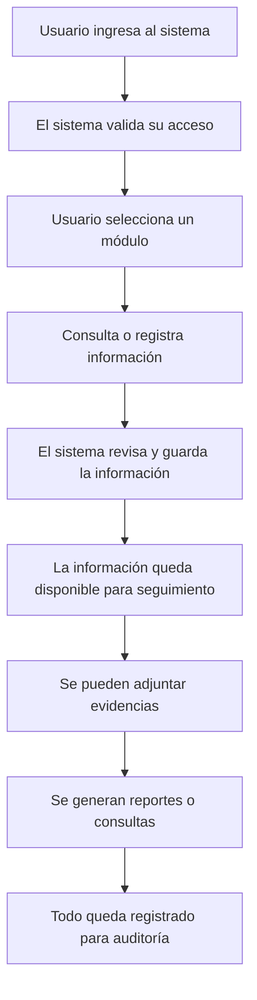

### Explicación para cliente

1. El usuario entra al sistema.
2. El sistema confirma que el usuario tiene permiso.
3. El usuario trabaja en el módulo que le corresponde.
4. La información se registra, consulta o actualiza.
5. El sistema conserva evidencia y seguimiento.
6. Todo queda trazable para revisión posterior.

---

## 3. Diagrama simple del acceso al sistema

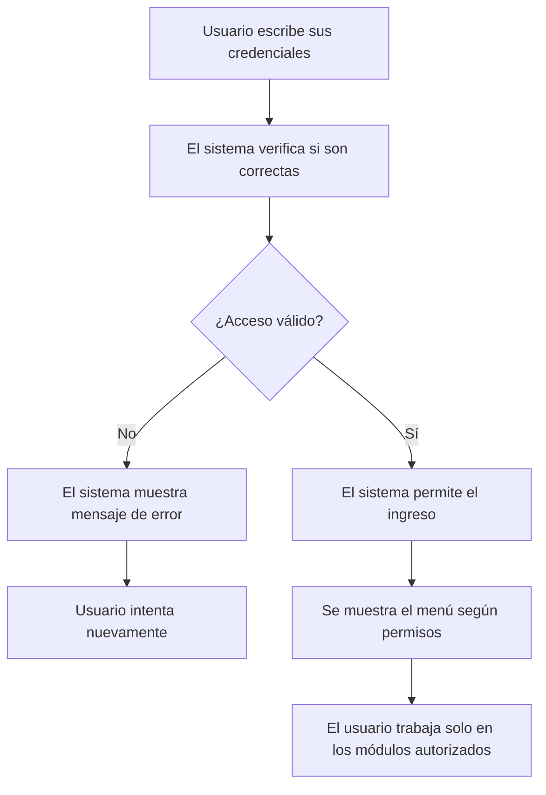

### Qué entiende el cliente

El sistema no deja entrar a cualquier persona. Cada usuario ve únicamente lo que tiene autorizado según su rol y permisos.

---

## 4. Registro de una persona o entidad en seguimiento

Este es el proceso cuando se registra una persona, empresa, empleado, patrono o tercero que requiere control dentro del sistema.

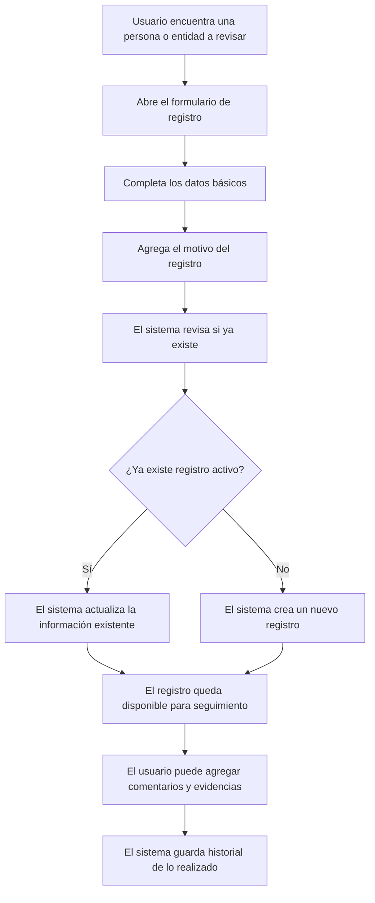

### Explicación para cliente

Cuando se registra una persona o entidad, el sistema primero revisa si ya existe. Si ya existe, no duplica el caso; actualiza el registro. Si no existe, crea uno nuevo. Después queda listo para seguimiento, evidencias y consultas.

---

## 5. Proceso de revisión de coincidencias

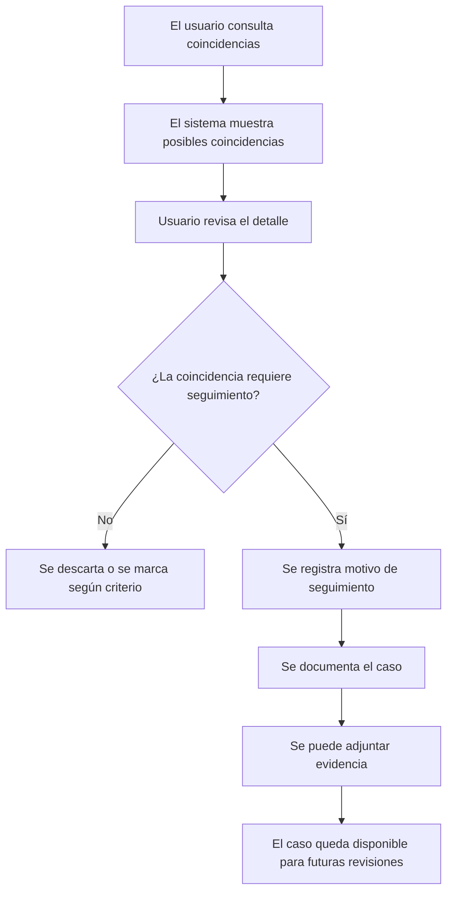

### Explicación para cliente

El sistema muestra coincidencias que deben revisarse. El usuario decide, según el análisis, si la coincidencia requiere seguimiento. Si requiere seguimiento, se documenta el motivo y se conserva evidencia.

---

## 6. Proceso de seguimiento de un caso

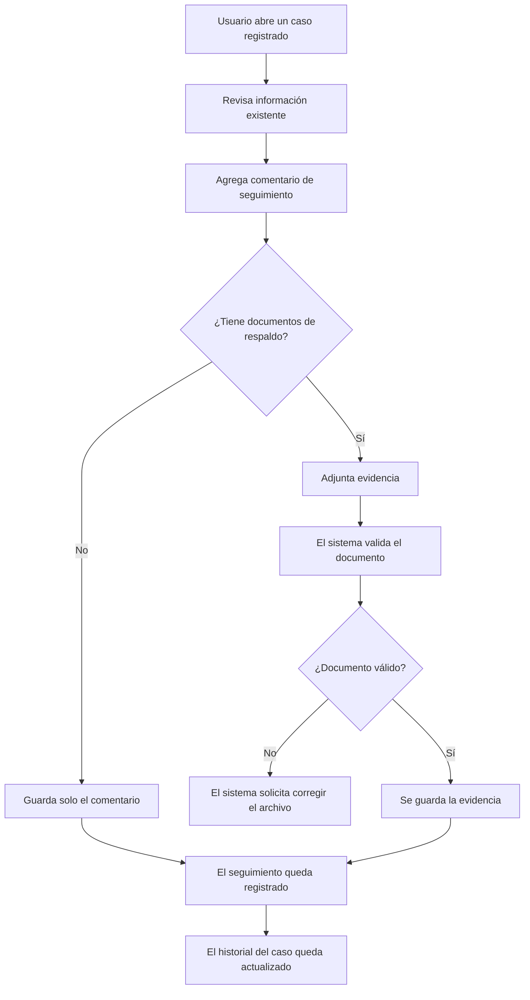

### Explicación para cliente

Cada caso puede tener comentarios y documentos. El sistema valida que los documentos sean aceptables y deja constancia de todo lo agregado.

---

## 7. Proceso de manejo de evidencias

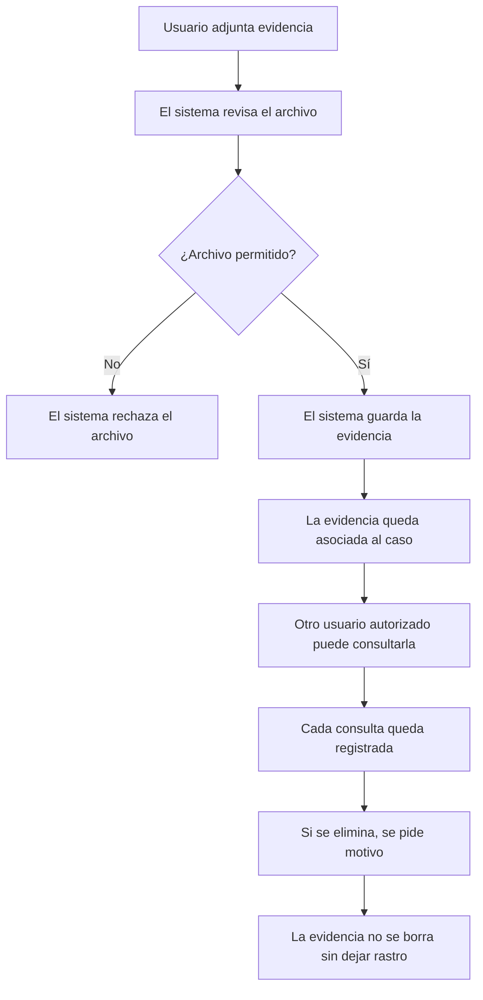

### Explicación para cliente

Las evidencias quedan controladas. Si alguien consulta o elimina una evidencia, el sistema deja historial. Esto ayuda a mantener transparencia y trazabilidad.

---

## 8. Proceso de carga de listas de control

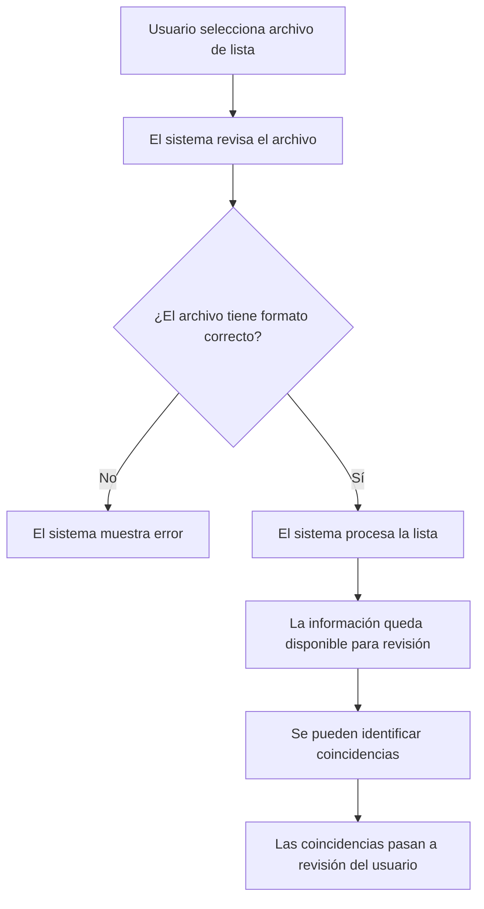

### Explicación para cliente

El usuario puede cargar listas de control. El sistema revisa si el archivo es válido y, si todo está correcto, lo procesa para que las coincidencias puedan ser revisadas.

---

## 9. Proceso de reportes y exportaciones

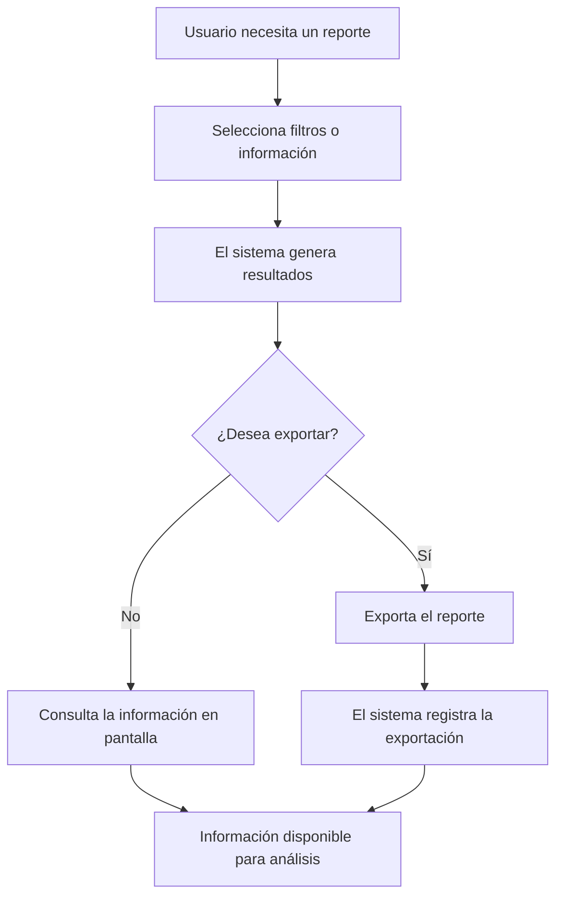

### Explicación para cliente

El sistema permite consultar información y exportarla cuando sea necesario. Si se exporta, queda registrado quién lo hizo y cuándo.

---

## 10. Proceso de auditoría

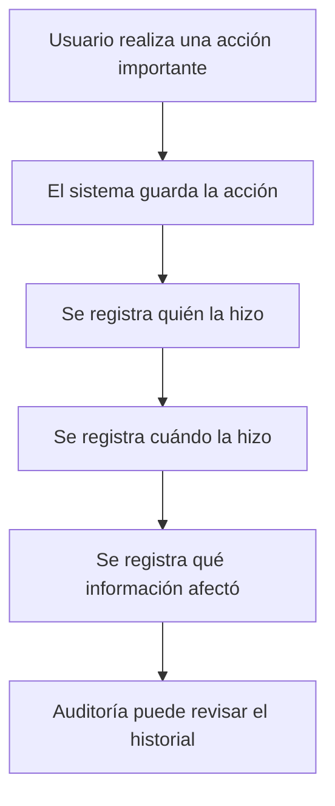

### Explicación para cliente

Cada acción importante queda registrada. Esto permite revisar posteriormente qué usuario realizó cambios, consultas, exportaciones o eliminaciones.

---

## 11. Ciclo completo de un caso

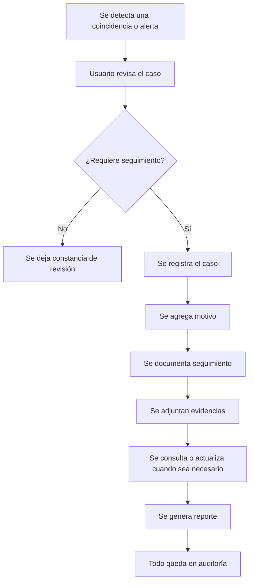

### Explicación para cliente

Un caso puede iniciar por una coincidencia o alerta. Luego se revisa, se documenta, se le da seguimiento, se agregan evidencias y puede generar reportes. Todo queda registrado.

---

## 12. Vista por módulos para cliente

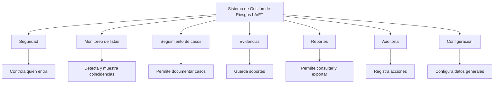

---

## 13. Qué gana el cliente con este sistema

| Beneficio | Explicación sencilla |
|---|---|
| Control de acceso | Solo usuarios autorizados pueden ingresar |
| Menos duplicidad | El sistema revisa si un registro ya existe |
| Seguimiento ordenado | Cada caso puede tener comentarios y evidencias |
| Trazabilidad | Se sabe quién hizo cada acción |
| Mejor documentación | Los casos quedan respaldados |
| Reportes | La información puede consultarse y exportarse |
| Control LA/FT | Ayuda a gestionar riesgos y coincidencias |

---

## 14. Diferencia entre este documento y la documentación técnica

| Documento | Para quién es | Qué contiene |
|---|---|---|
| Documento funcional para cliente | Cliente, usuarios, jefaturas, cumplimiento | Procesos explicados de forma simple |
| Documento técnico | Desarrolladores, Codex, equipo técnico | Código, rutas, componentes, base de datos y lógica interna |

---

## 15. Recomendación de uso

Para reuniones con cliente se recomienda usar este documento y no la documentación técnica.

La documentación técnica debe quedar como respaldo interno para desarrollo, mantenimiento, Codex y control del proyecto.
