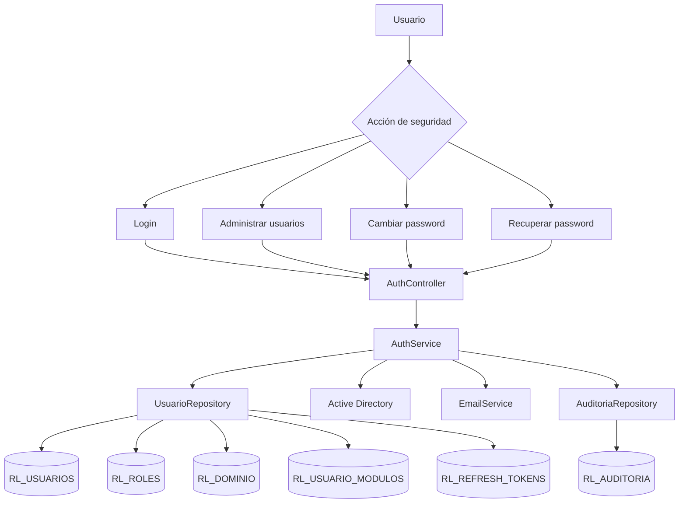
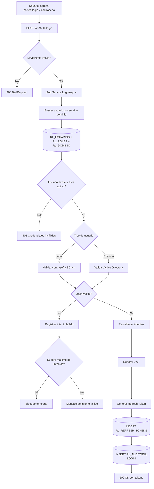
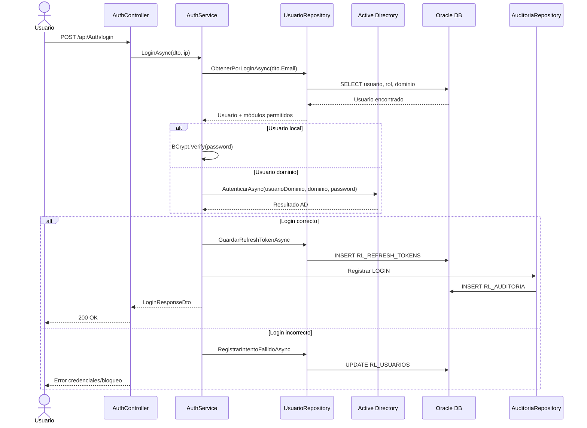
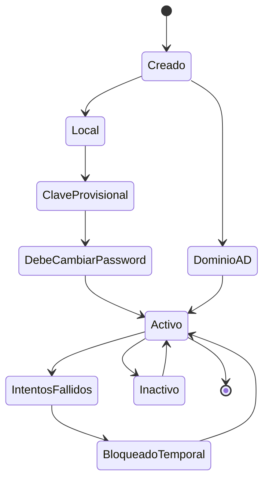

# 01 - MÓDULO SEGURIDAD, USUARIOS Y AUTENTICACIÓN

**Proyecto:** RIESGO_LAVADO  
**Backend:** `RL.API`  
**Estado:** Confirmado en repositorio  
**Versión:** 1.0  
**Fecha:** 2026-06-29

---

## 1. Objetivo funcional

Administrar el acceso al sistema, autenticación local o por Active Directory, emisión de JWT, refresh tokens, cierre de sesión, cambio y recuperación de contraseña, administración de usuarios, roles, dominios y módulos permitidos.

Este módulo es la base transversal del sistema porque controla quién puede ingresar, qué rol tiene y qué módulos puede utilizar.

---

## 2. Archivos técnicos identificados

| Archivo | Responsabilidad |
|---|---|
| `backend/RL.API/Controllers/AuthController.cs` | Endpoints de autenticación y administración de usuarios |
| `backend/RL.API/Services/AuthService.cs` | Lógica de login, tokens, password, usuarios y recuperación |
| `backend/RL.API/Repositories/UsuarioRepository.cs` | Operaciones Oracle de usuarios, roles, dominios, módulos y tokens |
| `backend/RL.API/Repositories/AuditoriaRepository.cs` | Auditoría de login, logout y cambios de usuario |
| `backend/RL.API/Security/ModuloAuthorize` | Control de acceso por módulo |
| `backend/RL.API/Program.cs` | Configuración JWT, DI, CORS, controllers y middleware |

---

## 3. Endpoints identificados

| Proceso | Endpoint | Método | Acceso |
|---|---|---:|---|
| Iniciar sesión | `/api/Auth/login` | POST | Público |
| Renovar token | `/api/Auth/refresh` | POST | Público |
| Cerrar sesión | `/api/Auth/logout` | POST | Autenticado |
| Cambiar contraseña | `/api/Auth/password` | PUT | Autenticado |
| Obtener perfil | `/api/Auth/perfil` | GET | Autenticado |
| Crear usuario | `/api/Auth/usuarios` | POST | Administrador + módulo 2 |
| Actualizar usuario | `/api/Auth/usuarios/{uid}` | PUT | Administrador + módulo 2 |
| Listar usuarios | `/api/Auth/usuarios` | GET | Administrador + módulo 2 |
| Activar/desactivar usuario | `/api/Auth/usuarios/{uid}/estado` | PUT | Administrador + módulo 2 |
| Validar dominio | `/api/Auth/validar-dominio` | GET | Administrador + módulo 2 |
| Recuperar contraseña | `/api/Auth/recuperar-password` | POST | Público |

---

## 4. Diagrama general del módulo

---

## 5. Flujo completo: inicio de sesión

---

## 6. Diagrama de secuencia: login

---

## 7. Ciclo de vida del usuario

---

## 8. Tablas involucradas

| Tabla | Operación | Uso |
|---|---|---|
| `RL_USUARIOS` | SELECT / INSERT / UPDATE | Usuarios, credenciales, estado, bloqueo, cambio de password |
| `RL_ROLES` | SELECT | Rol asignado al usuario |
| `RL_DOMINIO` | SELECT | Dominio institucional o AD |
| `RL_USUARIO_MODULOS` | SELECT / INSERT / DELETE | Módulos permitidos por usuario |
| `RL_REFRESH_TOKENS` | SELECT / INSERT / UPDATE | Tokens de renovación y revocación |
| `RL_AUDITORIA` | INSERT | Trazabilidad de login, logout, creación y actualización |

---

## 9. Reglas de negocio identificadas

1. El login soporta usuario local y usuario de dominio.
2. El usuario local valida contraseña con BCrypt.
3. El usuario de dominio valida credenciales contra Active Directory.
4. El sistema controla intentos fallidos y bloqueo temporal.
5. El JWT incluye rol, usuario, uid, dominio, módulos y obligación de cambio de contraseña.
6. El refresh token se guarda en base de datos.
7. Crear, actualizar, cambiar estado, login y logout deben auditarse.
8. La administración de usuarios está restringida a rol `ADMINISTRADOR` y módulo autorizado.

---

## 10. Riesgos y mejoras

| Riesgo / Mejora | Recomendación |
|---|---|
| Frontend no identificado en este repo | Documentar el repositorio o carpeta frontend |
| Bloqueo temporal actualmente corto | Confirmar regla institucional de tiempo de bloqueo |
| Auditoría de actualización depende de datos serializados | Estandarizar formato JSON auditado por todos los módulos |
| Cambios de módulos eliminan e insertan permisos | Validar transacción para evitar permisos incompletos ante error |

---

## 11. Estado del módulo

**Estado:** Confirmado y funcional en backend.  
**Nivel documental:** Alto.  
**Pendiente:** Asociar pantallas reales de frontend cuando se identifique el repositorio o carpeta correspondiente.
