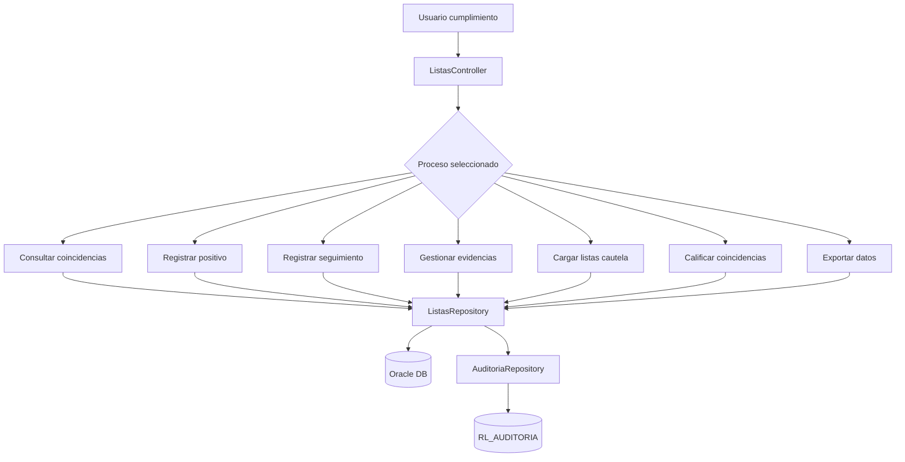
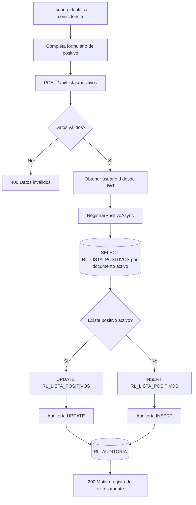
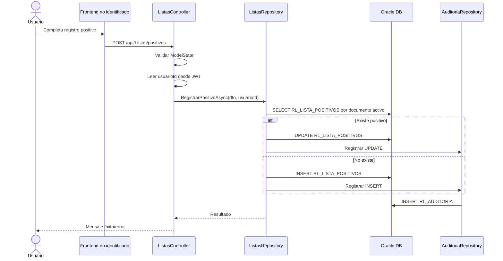
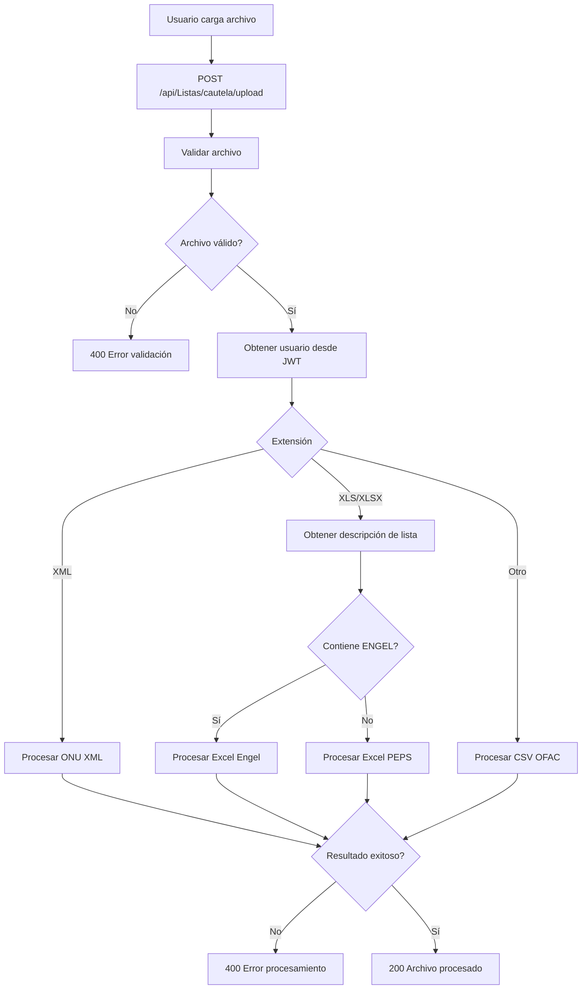
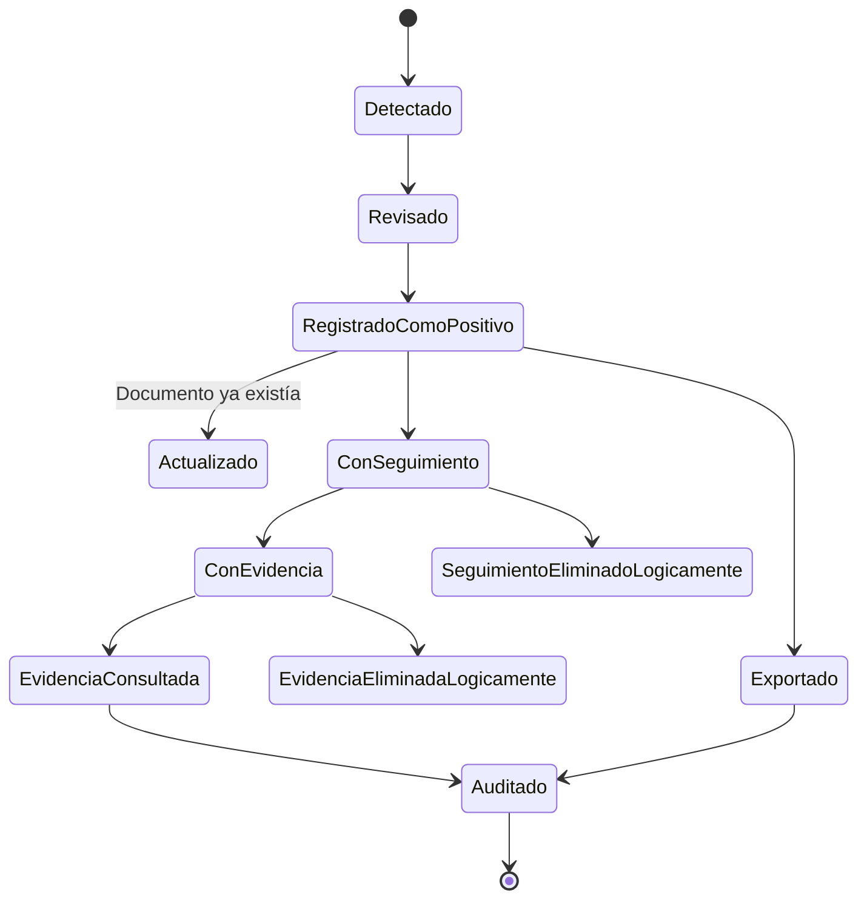

# 02 - MÓDULO MONITOREO DE LISTAS Y POSITIVOS

**Proyecto:** RIESGO_LAVADO  
**Backend:** `RL.API`  
**Estado:** Confirmado en repositorio  
**Versión:** 1.0  
**Fecha:** 2026-06-29

---

## 1. Objetivo funcional

Gestionar coincidencias contra listas de cautela, positivos internos, seguimientos, evidencias, carga de listas, exportaciones y calificación de coincidencias relacionadas con personas jurídicas, personas naturales, empleados y patronos.

Este módulo es uno de los componentes funcionales más importantes del sistema LA/FT porque concentra la detección, documentación, trazabilidad y seguimiento de posibles coincidencias.

---

## 2. Archivos técnicos identificados

| Archivo | Responsabilidad |
|---|---|
| `backend/RL.API/Controllers/ListasController.cs` | Endpoints de listas, positivos, seguimientos, evidencias y coincidencias |
| `backend/RL.API/Repositories/ListasRepository.cs` | Consultas y operaciones Oracle del módulo |
| `backend/RL.API/Repositories/AuditoriaRepository.cs` | Registro de auditoría transversal |
| `backend/RL.API/DTOs/*` | DTOs usados por listas, positivos, evidencias y coincidencias |

---

## 3. Endpoints identificados

| Proceso | Endpoint | Método |
|---|---|---:|
| Consultar jurídicas | `/api/Listas/juridicas` | GET |
| Consultar naturales | `/api/Listas/naturales` | GET |
| Consultar empleados | `/api/Listas/empleados` | GET |
| Detalle natural | `/api/Listas/naturales/{numeroIdentificacion}/detalle` | GET |
| Detalle empleado | `/api/Listas/empleados/{numeroIdentificacion}/detalle` | GET |
| Tipos documento | `/api/Listas/tipos-documento` | GET |
| Tipos listas cautela | `/api/Listas/tipos-listas-cautela` | GET |
| Resumen listas | `/api/Listas/resumen` | GET |
| Exportar lista | `/api/Listas/{id}/exportar` | GET |
| Crear tipo lista cautela | `/api/Listas/tipos-listas-cautela` | POST |
| Actualizar tipo lista cautela | `/api/Listas/tipos-listas-cautela/{id}` | PUT |
| Eliminar tipo lista cautela | `/api/Listas/tipos-listas-cautela/{id}` | DELETE |
| Registrar positivo | `/api/Listas/positivos` | POST |
| Consultar positivo | `/api/Listas/positivos/{noDocumento}` | GET |
| Consultar seguimientos | `/api/Listas/positivos/{noDocumento}/seguimientos` | GET |
| Registrar seguimiento | `/api/Listas/positivos/{noDocumento}/seguimientos` | POST |
| Descargar evidencia | `/api/Listas/evidencias/{evidenciaId}` | GET |
| Actualizar seguimiento | `/api/Listas/seguimientos/{detalleId}` | PUT |
| Eliminar evidencia | `/api/Listas/evidencias/{evidenciaId}` | DELETE |
| Eliminar seguimiento | `/api/Listas/seguimientos/{detalleId}` | DELETE |
| Registrar reporte impreso | `/api/Listas/positivos/{noDocumento}/reporte-impreso` | POST |
| Resumen patrono | `/api/Listas/coincidencias-patrono/resumen` | GET |
| Detalle patrono | `/api/Listas/coincidencias-patrono/detalle` | GET |
| Calificar patrono | `/api/Listas/coincidencias-patrono/{id}/calificar` | PUT |
| Resumen empleado | `/api/Listas/coincidencias-empleado/resumen` | GET |
| Detalle empleado | `/api/Listas/coincidencias-empleado/detalle` | GET |
| Calificar empleado | `/api/Listas/coincidencias-empleado/{id}/calificar` | PUT |
| Cargar lista cautela | `/api/Listas/cautela/upload` | POST |

---

## 4. Diagrama general del módulo



---

## 5. Proceso principal: registrar positivo

### 5.1 Descripción

Cuando el usuario registra una persona o entidad como positiva, el sistema valida el modelo, toma el usuario autenticado desde JWT, consulta si ya existe un positivo activo con el mismo documento y decide si actualiza o inserta. Luego registra auditoría.

### 5.2 Flujo gráfico



### 5.3 Diagrama de secuencia



### 5.4 Datos principales del positivo

| Dato | Uso |
|---|---|
| `TipoDocumentoId` | Tipo de documento |
| `TipoPositivoId` | Tipo de positivo |
| `NoDocumento` | Identificador principal |
| `NombreCompleto` | Nombre de persona o entidad |
| `MotivoIngreso` | Justificación del registro |
| `TipoListaCautelaId` | Lista asociada |
| `OrigenRegistro` | Origen manual o automático |
| `CreadoPorId` | Usuario autenticado |

---

## 6. Proceso: registrar seguimiento con evidencia

```mermaid
flowchart TD
    A[Usuario abre expediente positivo] --> B[Escribe comentario]
    B --> C[Adjunta archivos opcionales]
    C --> D[POST /api/Listas/positivos/{noDocumento}/seguimientos]
    D --> E{Comentario informado?}
    E -- No --> F[400 Comentario obligatorio]
    E -- Sí --> G[Buscar positivo activo]
    G --> H{Existe positivo?}
    H -- No --> I[404 Positivo no encontrado]
    H -- Sí --> J[Validar evidencias]
    J --> K{Archivos válidos?}
    K -- No --> L[400 Error de archivo]
    K -- Sí --> M[Registrar seguimiento]
    M --> N[Guardar archivos en Uploads/Evidencias]
    N --> O[Guardar metadata]
    O --> P[200 Seguimiento registrado]
```

### 6.1 Validaciones de evidencia

| Validación | Regla |
|---|---|
| Nombre | Debe existir y no tener caracteres inválidos |
| Tamaño | Mayor a 0 y menor al máximo permitido |
| Extensión | PDF, PNG, JPG, JPEG, DOC, DOCX, XLS, XLSX |
| MIME | Debe coincidir con la extensión permitida |
| Ruta física | Se guarda con nombre único GUID |

---

## 7. Proceso: descargar evidencia

```mermaid
flowchart TD
    A[Usuario solicita evidencia] --> B[GET /api/Listas/evidencias/{evidenciaId}]
    B --> C[Buscar metadata]
    C --> D{Existe metadata?}
    D -- No --> E[404 Evidencia no encontrada]
    D -- Sí --> F[Construir ruta física]
    F --> G{Archivo existe?}
    G -- No --> H[404 Archivo físico no existe]
    G -- Sí --> I[Registrar visualización]
    I --> J[Leer bytes]
    J --> K[Retornar archivo]
```

---

## 8. Proceso: eliminar evidencia

```mermaid
flowchart TD
    A[Usuario elimina evidencia] --> B[DELETE /api/Listas/evidencias/{evidenciaId}]
    B --> C{Motivo informado?}
    C -- No --> D[400 Motivo obligatorio]
    C -- Sí --> E[Buscar metadata]
    E --> F{Existe evidencia?}
    F -- No --> G[404 Evidencia no encontrada]
    F -- Sí --> H[Eliminar lógicamente metadata]
    H --> I[Conservar archivo físico]
    I --> J[Registrar trazabilidad]
    J --> K[200 Evidencia eliminada]
```

---

## 9. Proceso: carga de lista de cautela



---

## 10. Proceso: calificar coincidencias

```mermaid
flowchart TD
    A[Usuario revisa coincidencia] --> B{Tipo coincidencia}
    B -- Patrono --> C[PUT /api/Listas/coincidencias-patrono/{id}/calificar]
    B -- Empleado --> D[PUT /api/Listas/coincidencias-empleado/{id}/calificar]
    C --> E[Validar body]
    D --> E
    E --> F{TipoCalificacionId informado?}
    F -- No --> G[400 Solicitud inválida]
    F -- Sí --> H[Obtener usuarioId desde JWT]
    H --> I[CalificarCoincidenciaAsync]
    I --> J{Registro encontrado?}
    J -- No --> K[404 No encontrado]
    J -- Sí --> L[200 Calificación registrada]
```

---

## 11. Tablas y fuentes involucradas

| Tabla / Fuente | Operación | Uso |
|---|---|---|
| `RL_LISTA_POSITIVOS` | SELECT / INSERT / UPDATE | Positivos internos |
| `RL_AUDITORIA` | INSERT | Auditoría transversal |
| `DNP_IHSS.REPORTE_COINCIDENCIAS` | SELECT | Coincidencias detectadas |
| `DNP_IHSS.TIPO_LISTAS_CAUTELA` | SELECT / INSERT / UPDATE / DELETE lógico | Catálogo de listas |
| `DNP_IHSS.V_DATOS_EMPRESA` | SELECT | Datos de empresas/patronos |
| `DNP_IHSS.V_SOCIOS_REPRESENTANTES` | SELECT | Personas naturales relacionadas |
| `DNP_IHSS.V_EMPLEADOS_IHSS_PLANILLAS` | SELECT | Empleados IHSS |
| Seguimientos / Evidencias | INSERT / UPDATE / DELETE lógico | Expediente documental |

---

## 12. Ciclo de vida del positivo



---

## 13. Reglas de negocio identificadas

1. Un positivo activo se identifica principalmente por documento y estado activo.
2. Si el positivo ya existe, se actualiza en lugar de duplicarse.
3. Si no existe, se crea mediante secuencia Oracle.
4. Todo registro o actualización de positivo debe auditarse.
5. El seguimiento exige comentario obligatorio.
6. Las evidencias se validan por extensión, MIME, tamaño y nombre.
7. La eliminación de evidencia es lógica y exige motivo.
8. El archivo físico se conserva para trazabilidad.
9. La carga de listas decide procesador por extensión y descripción.
10. Las coincidencias de patrono y empleado pueden calificarse.

---

## 14. Riesgos y mejoras

| Riesgo / Mejora | Recomendación |
|---|---|
| Gran concentración de lógica en `ListasController` | Separar procesos en servicios especializados |
| Evidencias guardadas en filesystem local | Evaluar almacenamiento institucional, ruta segura o repositorio documental |
| Eliminación lógica correcta, pero debe quedar visible en auditoría funcional | Agregar reporte específico de eliminaciones |
| Carga de archivos depende de extensión/descripción | Agregar configuración formal por tipo de lista |
| Frontend no identificado | Asociar cada endpoint con pantalla real cuando se ubique frontend |

---

## 15. Estado del módulo

**Estado:** Confirmado y avanzado en backend.  
**Nivel documental:** Alto.  
**Pendiente:** Vincular pantallas frontend, normalizar servicios y completar documentación de tablas físicas de seguimientos/evidencias.
