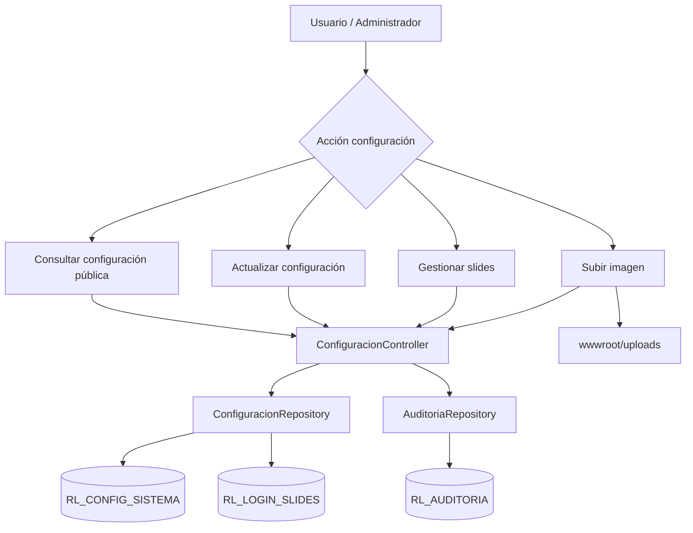
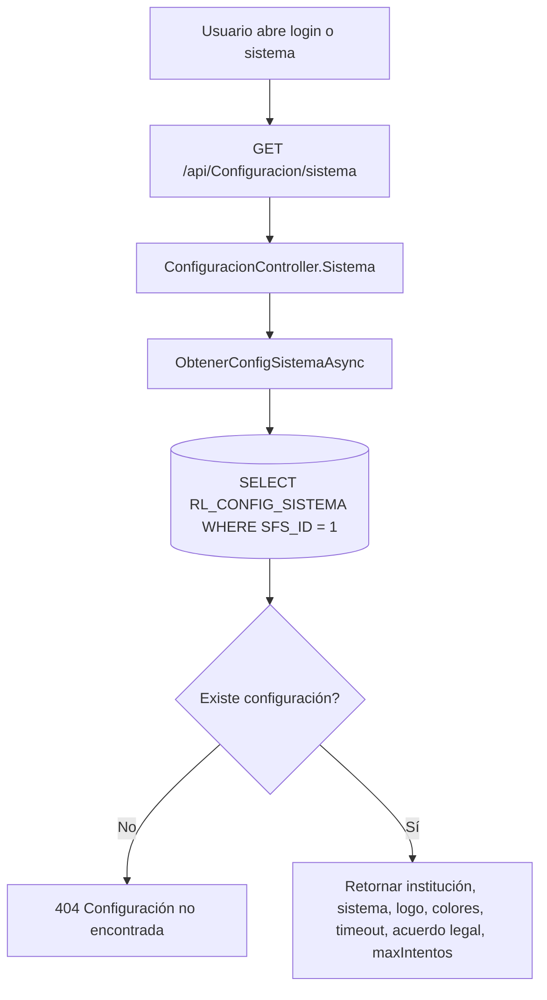
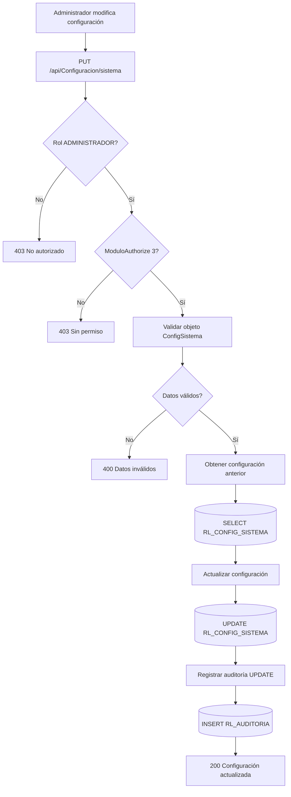
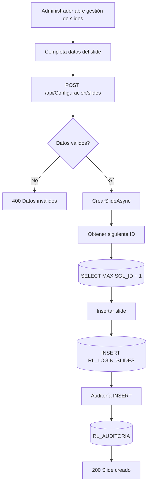
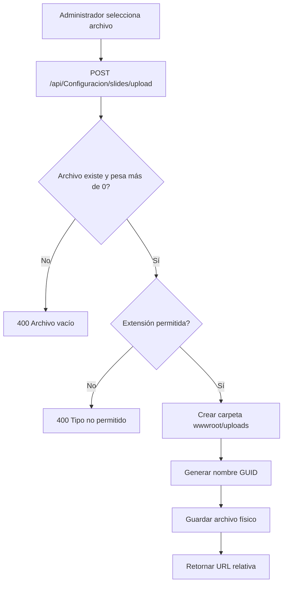

# 03 - MÓDULO CONFIGURACIÓN DEL SISTEMA

**Proyecto:** RIESGO_LAVADO  
**Backend:** `RL.API`  
**Estado:** Confirmado en repositorio  
**Versión:** 1.0  
**Fecha:** 2026-06-29

---

## 1. Objetivo funcional

Administrar la configuración institucional y visual del sistema, incluyendo nombre de institución, nombre del sistema, logo, icono, colores, timeout de sesión, acuerdo legal, máximo de intentos, validez de clave temporal, slides de login y carga de imágenes.

Este módulo afecta directamente la experiencia inicial del usuario y algunos parámetros de seguridad utilizados por autenticación.

---

## 2. Archivos técnicos identificados

| Archivo | Responsabilidad |
|---|---|
| `backend/RL.API/Controllers/ConfiguracionController.cs` | Endpoints de configuración, slides y carga de imágenes |
| `backend/RL.API/Repositories/ConfiguracionRepository.cs` | Operaciones Oracle contra configuración y slides |
| `backend/RL.API/Repositories/AuditoriaRepository.cs` | Auditoría de cambios |
| `backend/RL.API/Models/ConfigSistema` | Modelo de configuración del sistema |
| `backend/RL.API/Models/LoginSlide` | Modelo de slide de login |

---

## 3. Endpoints identificados

| Proceso | Endpoint | Método | Acceso |
|---|---|---:|---|
| Obtener configuración pública | `/api/Configuracion/sistema` | GET | Público |
| Actualizar configuración | `/api/Configuracion/sistema` | PUT | Administrador + módulo 3 |
| Obtener slides activos login | `/api/Configuracion/login` | GET | Público |
| Obtener todos los slides | `/api/Configuracion/slides` | GET | Administrador + módulo 3 |
| Crear slide | `/api/Configuracion/slides` | POST | Administrador + módulo 3 |
| Actualizar slide | `/api/Configuracion/slides/{id}` | PUT | Administrador + módulo 3 |
| Eliminar slide | `/api/Configuracion/slides/{id}` | DELETE | Administrador + módulo 3 |
| Subir imagen de slide | `/api/Configuracion/slides/upload` | POST | Administrador + módulo 3 |

---

## 4. Diagrama general del módulo



---

## 5. Proceso: obtener configuración pública



---

## 6. Proceso: actualizar configuración general



---

## 7. Proceso: crear slide de login



---

## 8. Proceso: actualizar slide de login

```mermaid
flowchart TD
    A[Administrador edita slide] --> B[PUT /api/Configuracion/slides/{id}]
    B --> C{Datos válidos?}
    C -- No --> D[400 Datos inválidos]
    C -- Sí --> E[Obtener slide anterior]
    E --> F[(SELECT RL_LOGIN_SLIDES)]
    F --> G[Actualizar slide]
    G --> H[(UPDATE RL_LOGIN_SLIDES)]
    H --> I[Auditoría UPDATE]
    I --> J[(RL_AUDITORIA)]
    J --> K[200 Slide actualizado]
```

---

## 9. Proceso: eliminar slide de login

```mermaid
flowchart TD
    A[Administrador elimina slide] --> B[DELETE /api/Configuracion/slides/{id}]
    B --> C[Obtener slide anterior]
    C --> D[(SELECT RL_LOGIN_SLIDES)]
    D --> E[Eliminar slide]
    E --> F[(DELETE RL_LOGIN_SLIDES)]
    F --> G{Eliminado?}
    G -- No --> H[400 No se pudo eliminar]
    G -- Sí --> I[Auditoría DELETE]
    I --> J[(RL_AUDITORIA)]
    J --> K[200 Slide eliminado]
```

---

## 10. Proceso: subir imagen de slide



---

## 11. Tablas involucradas

| Tabla | Operación | Uso |
|---|---|---|
| `RL_CONFIG_SISTEMA` | SELECT / UPDATE | Configuración general del sistema |
| `RL_LOGIN_SLIDES` | SELECT / INSERT / UPDATE / DELETE | Slides de pantalla login |
| `RL_AUDITORIA` | INSERT | Trazabilidad de cambios |

---

## 12. Datos administrados

| Campo funcional | Uso |
|---|---|
| Nombre institución | Identidad institucional |
| Nombre sistema | Nombre visible del sistema |
| Logo URL | Imagen institucional |
| Icono URL | Icono del sistema |
| Color primario | Personalización visual |
| Color secundario | Personalización visual |
| Timeout sesión | Parámetro de sesión |
| Acuerdo legal | Texto visible en acceso o login |
| Máximo intentos | Regla usada por autenticación |
| Validez clave temporal | Regla para recuperación/cambio de contraseña |
| Slides login | Contenido visual de login |

---

## 13. Reglas de negocio identificadas

1. La configuración pública puede ser consultada sin autenticación.
2. La actualización de configuración requiere rol `ADMINISTRADOR` y autorización de módulo 3.
3. Los slides activos se consultan públicamente para login.
4. La administración completa de slides requiere rol administrador.
5. Las imágenes permitidas son `jpg`, `jpeg`, `png`, `gif` y `webp`.
6. Las imágenes se guardan en `wwwroot/uploads` con nombre único.
7. Crear, actualizar y eliminar slides genera auditoría.
8. Actualizar configuración general genera auditoría con datos anteriores y nuevos.

---

## 14. Riesgos y mejoras

| Riesgo / Mejora | Recomendación |
|---|---|
| Eliminación física de slide en tabla | Evaluar eliminación lógica si se requiere trazabilidad total |
| Imágenes en filesystem local | Definir política de respaldo y ruta institucional |
| Configuración pública incluye datos sensibles indirectos | Revisar que solo se exponga información necesaria |
| Color/logo sin validación profunda | Validar formatos HEX/URL en backend |

---

## 15. Estado del módulo

**Estado:** Confirmado en backend.  
**Nivel documental:** Alto.  
**Pendiente:** Asociar pantallas frontend reales y definir si `RL_LOGIN_SLIDES` debe usar eliminación lógica.
