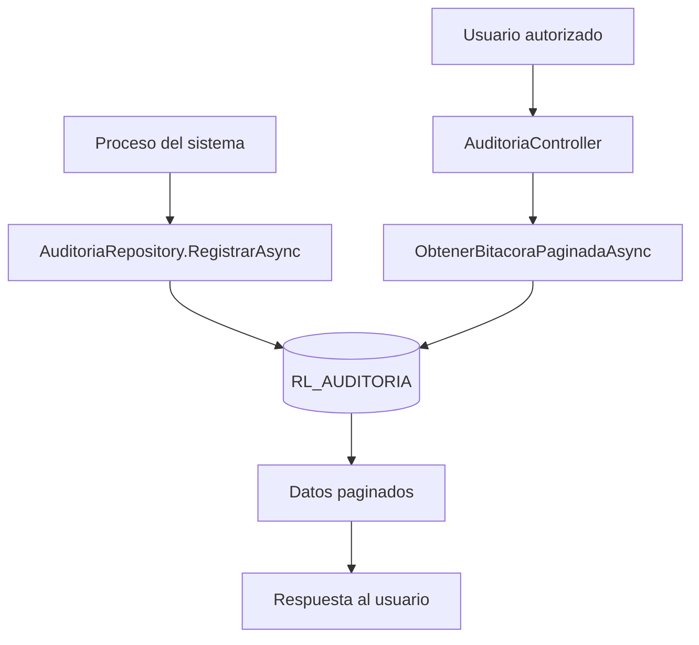
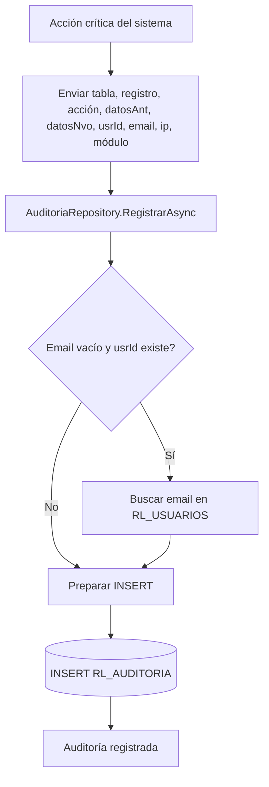
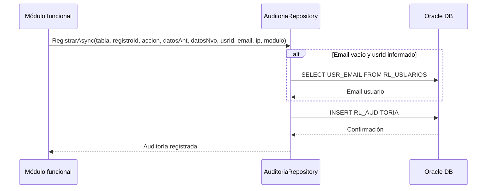
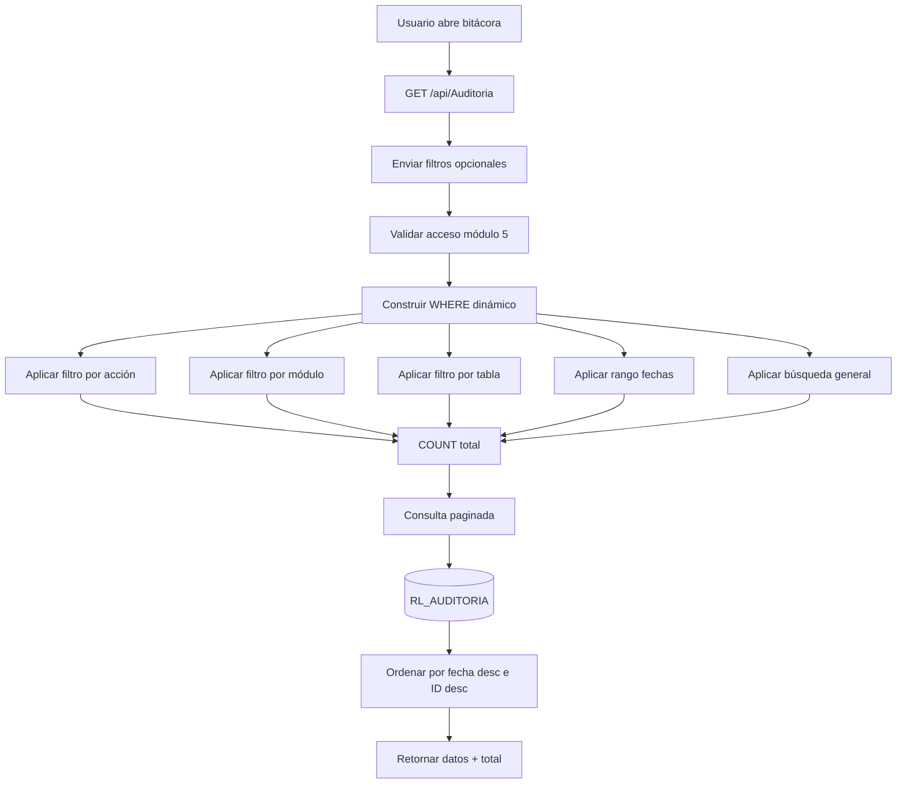
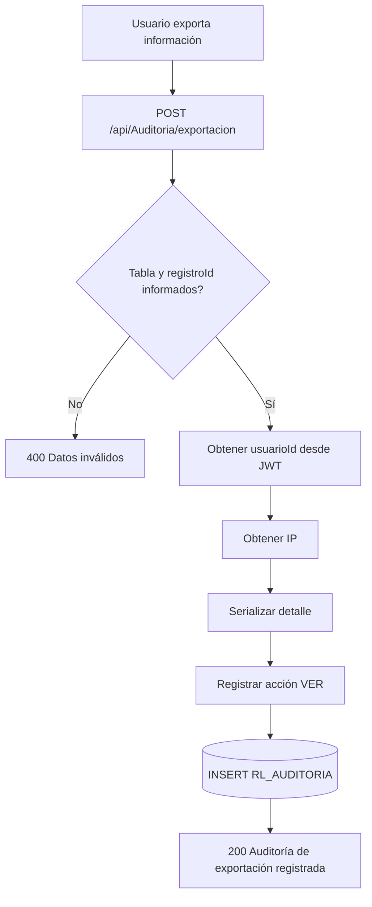
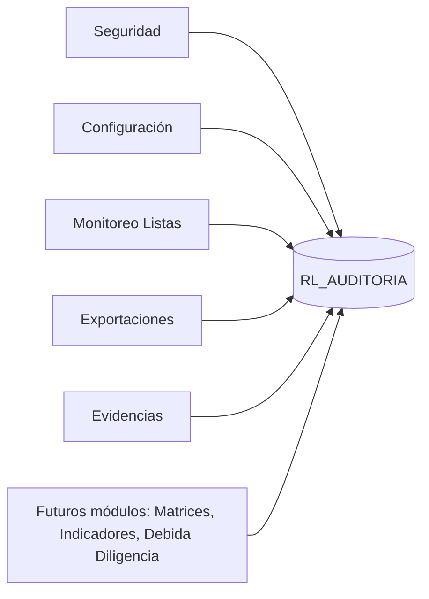

# 04 - MÓDULO AUDITORÍA Y BITÁCORA

**Proyecto:** RIESGO_LAVADO  
**Backend:** `RL.API`  
**Estado:** Confirmado en repositorio  
**Versión:** 1.0  
**Fecha:** 2026-06-29

---

## 1. Objetivo funcional

Registrar, consultar y controlar la trazabilidad de las acciones relevantes del sistema. Este módulo permite revisar quién hizo qué, cuándo lo hizo, sobre qué tabla o registro, desde qué IP, en qué módulo y con qué datos anteriores o nuevos.

En un sistema LA/FT, auditoría no es un módulo secundario: es un control transversal obligatorio.

---

## 2. Archivos técnicos identificados

| Archivo | Responsabilidad |
|---|---|
| `backend/RL.API/Controllers/AuditoriaController.cs` | Endpoints de consulta de bitácora y auditoría de exportación |
| `backend/RL.API/Repositories/AuditoriaRepository.cs` | Inserción y consulta paginada de auditoría |
| `backend/RL.API/DTOs/AuditoriaDto` | DTO de registros de auditoría |
| `backend/RL.API/DTOs/AuditoriaPaginadoDto` | DTO de respuesta paginada |
| `backend/RL.API/DTOs/RegistrarExportacionAuditoriaDto` | DTO para registrar exportaciones |

---

## 3. Endpoints identificados

| Proceso | Endpoint | Método | Acceso |
|---|---|---:|---|
| Consultar bitácora | `/api/Auditoria` | GET | Autenticado + módulo 5 |
| Registrar exportación | `/api/Auditoria/exportacion` | POST | Autenticado + módulo 5 |

---

## 4. Diagrama general del módulo

---

## 5. Proceso transversal: registrar auditoría

---

## 6. Diagrama de secuencia: auditoría transversal

---

## 7. Proceso: consultar bitácora

---

## 8. Proceso: registrar exportación

---

## 9. Campos auditados

| Campo | Descripción |
|---|---|
| `AUD_ID` | Identificador del evento de auditoría |
| `AUD_TABLA` | Tabla o entidad afectada |
| `AUD_REGISTRO_ID` | Identificador del registro afectado |
| `AUD_ACCION` | Acción realizada: INSERT, UPDATE, DELETE, VER, LOGIN, LOGOUT, etc. |
| `AUD_DATOS_ANT` | Datos anteriores serializados |
| `AUD_DATOS_NVO` | Datos nuevos serializados |
| `AUD_USR_ID` | Usuario que ejecutó la acción |
| `AUD_USR_EMAIL` | Email o nombre visible del usuario |
| `AUD_IP` | IP origen |
| `AUD_FECHA` | Fecha de registro |
| `AUD_MODULO` | Módulo funcional asociado |

---

## 10. Filtros de consulta identificados

| Filtro | Uso |
|---|---|
| `pagina` | Número de página |
| `limite` | Registros por página |
| `buscar` | Búsqueda general por usuario, tabla, IP o registro |
| `accion` | Acción exacta |
| `modulo` | Módulo exacto |
| `tabla` | Tabla exacta |
| `fechaInicio` | Fecha inicial |
| `fechaFin` | Fecha final |

---

## 11. Acciones que deben auditarse

| Acción | Debe auditarse | Observación |
|---|---|---|
| Login | Sí | Control de acceso |
| Logout | Sí | Cierre de sesión |
| Crear usuario | Sí | Seguridad |
| Actualizar usuario | Sí | Seguridad |
| Cambiar estado usuario | Sí | Seguridad |
| Cambiar contraseña | Sí | Seguridad |
| Crear positivo | Sí | LA/FT |
| Actualizar positivo | Sí | LA/FT |
| Registrar seguimiento | Recomendado | Debe reforzarse si no está completo |
| Eliminar evidencia | Sí | Requiere motivo |
| Descargar evidencia | Sí | Visualización sensible |
| Exportar datos | Sí | Riesgo de extracción de información |
| Configuración sistema | Sí | Parámetros críticos |
| Slides login | Sí | Configuración visual/institucional |

---

## 12. Relación con otros módulos

---

## 13. Reglas de negocio identificadas

1. La auditoría se centraliza en `AuditoriaRepository`.
2. Si se recibe `usrId` pero no email, el repositorio intenta consultar el email en `RL_USUARIOS`.
3. La consulta de bitácora es paginada.
4. Los filtros son dinámicos.
5. La tabla puede filtrarse de forma exacta.
6. La búsqueda general puede consultar usuario, tabla, IP o registro.
7. La exportación se registra como acción `VER` con detalle serializado.
8. El módulo 5 controla acceso a auditoría.

---

## 14. Riesgos y mejoras

| Riesgo / Mejora | Recomendación |
|---|---|
| Acción de exportación registrada como `VER` | Evaluar acción específica `EXPORTAR` para análisis posterior |
| Algunos procesos podrían no auditar todo | Crear checklist técnico de auditoría obligatoria por endpoint |
| Datos JSON sin estructura estándar | Definir formato común: usuario, fecha, acción, before, after, motivo |
| No se observa retención documental | Definir política de conservación de auditoría |
| Riesgo de crecimiento de tabla | Crear particionamiento, índices y plan de archivo histórico |

---

## 15. Estado del módulo

**Estado:** Confirmado en backend.  
**Nivel documental:** Alto.  
**Pendiente:** Estandarizar nombres de acciones, definir política de retención y verificar cobertura total por cada endpoint crítico.
