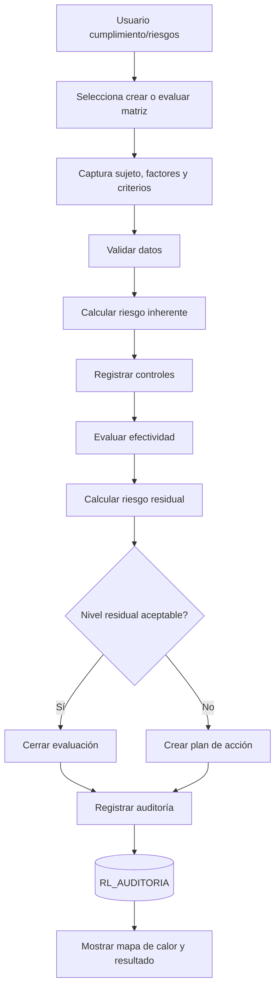
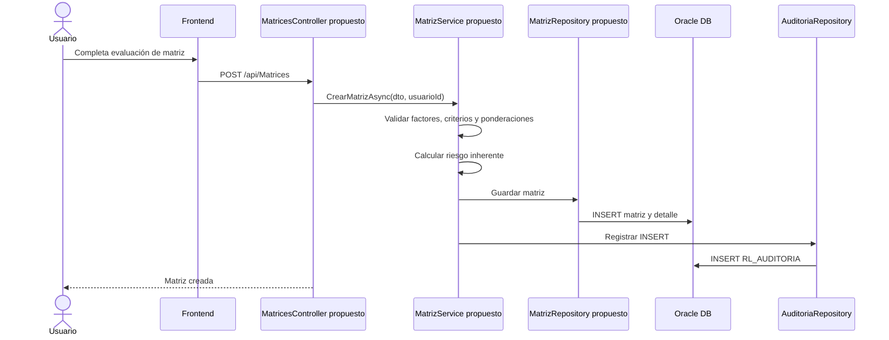
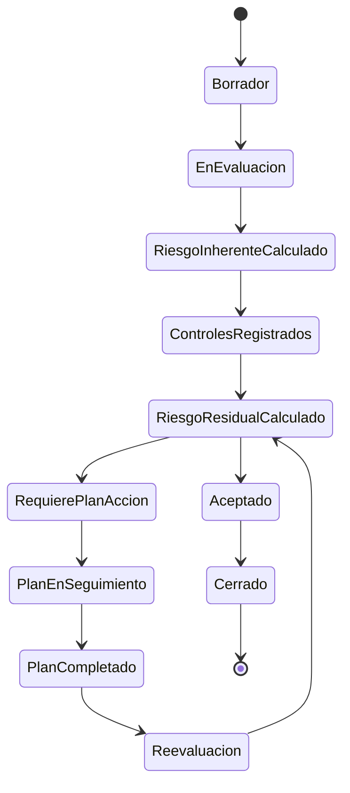

# 05 - MÓDULO MATRICES DE RIESGO

**Proyecto:** RIESGO_LAVADO  
**Backend:** `RL.API`  
**Estado:** Pendiente de confirmar en repositorio  
**Versión:** 0.1  
**Fecha:** 2026-06-29

---

## 1. Estado actual

En la revisión del repositorio `jmejia31/RIESGO_LAVADO`, no se identificó todavía un controlador, servicio, repositorio o conjunto de tablas específico para el módulo de matrices de riesgo.

Este documento queda creado como placeholder técnico-funcional para que el módulo pueda desarrollarse o documentarse siguiendo el mismo estándar del resto del sistema.

---

## 2. Objetivo funcional esperado

Gestionar matrices de riesgo LA/FT mediante factores, criterios, ponderaciones, probabilidad, impacto, riesgo inherente, controles, efectividad, riesgo residual, planes de acción, mapas de calor y trazabilidad de cambios.

---

## 3. Alcance funcional esperado

| Área | Descripción esperada |
|---|---|
| Factores de riesgo | Cliente, producto, canal, zona geográfica, transacción, contraparte u otros |
| Criterios de evaluación | Variables evaluables por factor |
| Ponderaciones | Peso porcentual o numérico por factor/criterio |
| Escalas | Rangos bajo, medio, alto, crítico |
| Probabilidad | Frecuencia o posibilidad de ocurrencia |
| Impacto | Efecto operativo, legal, reputacional o económico |
| Riesgo inherente | Nivel antes de controles |
| Controles | Medidas mitigantes aplicadas |
| Efectividad de control | Evaluación de diseño y ejecución |
| Riesgo residual | Nivel posterior a controles |
| Plan de acción | Tratamiento para riesgos no aceptables |
| Mapa de calor | Visualización gráfica de riesgo |
| Auditoría | Trazabilidad de cambios y evaluaciones |

---

## 4. Interfaces esperadas

| Código sugerido | Pantalla | Función |
|---|---|---|
| UI-MR-001 | Dashboard de matrices | Resumen de matrices activas, vencidas y por nivel |
| UI-MR-002 | Administración de factores | Crear/editar factores de riesgo |
| UI-MR-003 | Administración de criterios | Crear/editar criterios por factor |
| UI-MR-004 | Configuración de ponderaciones | Asignar pesos y reglas de cálculo |
| UI-MR-005 | Registro de matriz | Crear matriz por sujeto/proceso/área |
| UI-MR-006 | Evaluación inherente | Capturar probabilidad e impacto |
| UI-MR-007 | Controles mitigantes | Registrar controles y efectividad |
| UI-MR-008 | Evaluación residual | Calcular riesgo residual |
| UI-MR-009 | Mapa de calor | Visualizar riesgos por nivel |
| UI-MR-010 | Planes de acción | Registrar y dar seguimiento a acciones |
| UI-MR-011 | Historial y auditoría | Consultar cambios de matriz |
| UI-MR-012 | Reportes | Exportar resultados |

---

## 5. Endpoints propuestos

| Proceso | Endpoint sugerido | Método |
|---|---|---:|
| Listar matrices | `/api/Matrices` | GET |
| Obtener matriz | `/api/Matrices/{id}` | GET |
| Crear matriz | `/api/Matrices` | POST |
| Actualizar matriz | `/api/Matrices/{id}` | PUT |
| Inactivar matriz | `/api/Matrices/{id}` | DELETE |
| Listar factores | `/api/Matrices/factores` | GET |
| Crear factor | `/api/Matrices/factores` | POST |
| Actualizar factor | `/api/Matrices/factores/{id}` | PUT |
| Listar criterios | `/api/Matrices/criterios` | GET |
| Crear criterio | `/api/Matrices/criterios` | POST |
| Configurar ponderaciones | `/api/Matrices/ponderaciones` | PUT |
| Evaluar inherente | `/api/Matrices/{id}/inherente` | POST |
| Registrar controles | `/api/Matrices/{id}/controles` | POST |
| Evaluar residual | `/api/Matrices/{id}/residual` | POST |
| Obtener mapa de calor | `/api/Matrices/mapa-calor` | GET |
| Crear plan de acción | `/api/Matrices/{id}/planes-accion` | POST |
| Actualizar plan de acción | `/api/Matrices/planes-accion/{id}` | PUT |
| Exportar matriz | `/api/Matrices/{id}/exportar` | GET |

---

## 6. Diagrama general esperado



---

## 7. Diagrama de secuencia esperado



---

## 8. Ciclo de vida esperado de la matriz



---

## 9. Modelo de datos sugerido

| Tabla sugerida | Uso |
|---|---|
| `RL_MATRICES_RIESGO` | Encabezado de matriz |
| `RL_MATRIZ_FACTORES` | Factores evaluados en matriz |
| `RL_MATRIZ_CRITERIOS` | Criterios por factor |
| `RL_MATRIZ_PONDERACIONES` | Pesos aplicados |
| `RL_MATRIZ_EVALUACIONES` | Evaluación de probabilidad, impacto e inherente |
| `RL_MATRIZ_CONTROLES` | Controles mitigantes |
| `RL_MATRIZ_RESIDUAL` | Resultado residual |
| `RL_MATRIZ_PLANES_ACCION` | Planes de tratamiento |
| `RL_MATRIZ_HISTORIAL` | Historial funcional de cambios |
| `RL_AUDITORIA` | Auditoría transversal |

---

## 10. Reglas de negocio esperadas

1. Toda matriz debe tener vigencia, responsable y estado.
2. Los factores deben tener ponderación total válida.
3. La suma de ponderaciones debe controlarse por backend.
4. El riesgo inherente se calcula antes de controles.
5. Los controles deben tener evaluación de efectividad.
6. El riesgo residual se calcula después de controles.
7. Riesgo residual alto o crítico debe generar plan de acción.
8. Toda modificación debe auditarse.
9. La eliminación debe ser lógica, no física.
10. Las exportaciones deben registrarse en auditoría.

---

## 11. Riesgos si se desarrolla sin este estándar

| Riesgo | Impacto |
|---|---|
| Cálculos dispersos en frontend | Riesgo de manipulación o inconsistencia |
| Falta de auditoría | Incumplimiento de trazabilidad LA/FT |
| Eliminación física | Pérdida de historial |
| Sin control de ponderaciones | Resultados incorrectos |
| Sin versionado de matriz | No se podrá comparar evolución del riesgo |
| Sin planes de acción | Riesgos altos quedarían sin tratamiento |

---

## 12. Recomendación técnica

Cuando se implemente este módulo, crear como mínimo:

```text
backend/RL.API/Controllers/MatricesController.cs
backend/RL.API/Services/MatrizService.cs
backend/RL.API/Repositories/MatrizRepository.cs
backend/RL.API/DTOs/Matrices/
backend/RL.API/Models/Matrices/
```

Además, todo cálculo sensible debe ejecutarse en backend, no únicamente en frontend.

---

## 13. Estado del módulo

**Estado:** Pendiente de confirmar/desarrollar en repositorio actual.  
**Nivel documental:** Base funcional propuesta.  
**Pendiente:** Confirmar si existe en otra rama, otro repositorio o si todavía debe desarrollarse.
